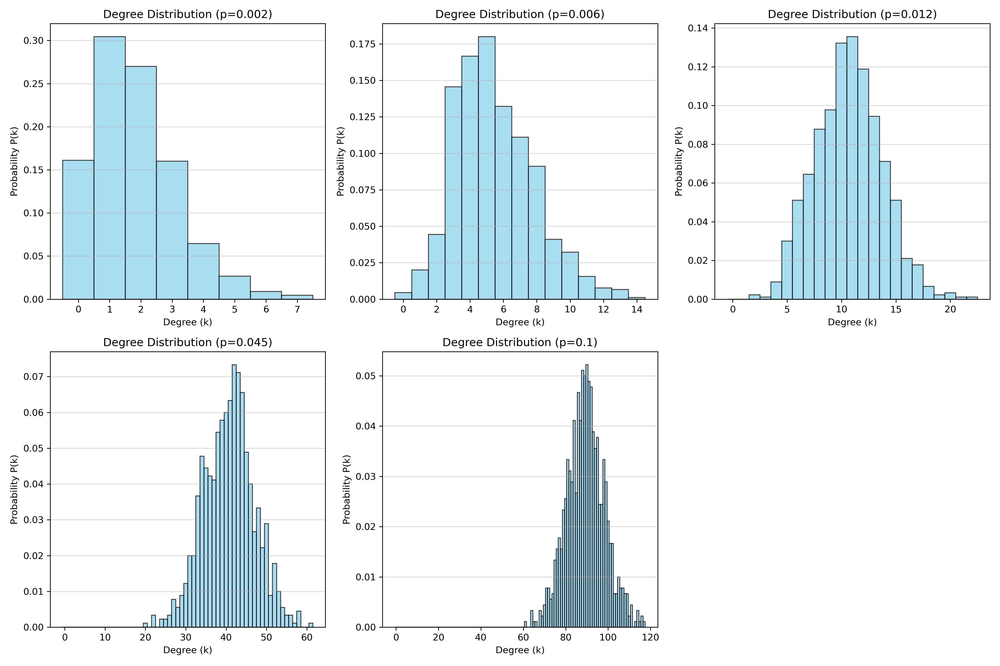
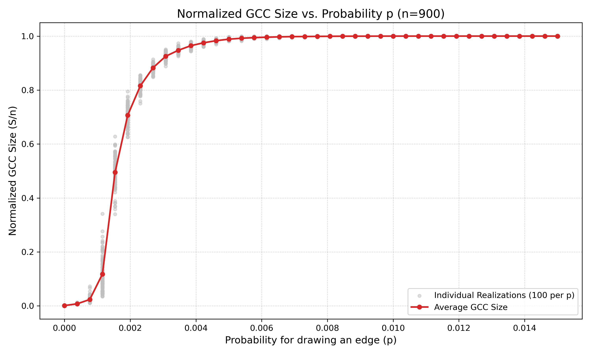
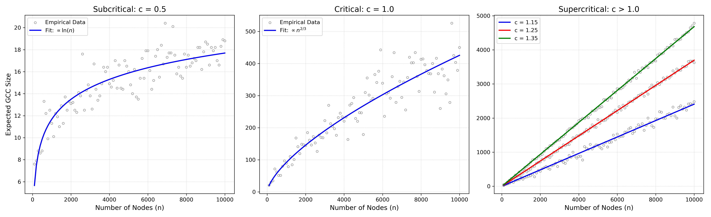
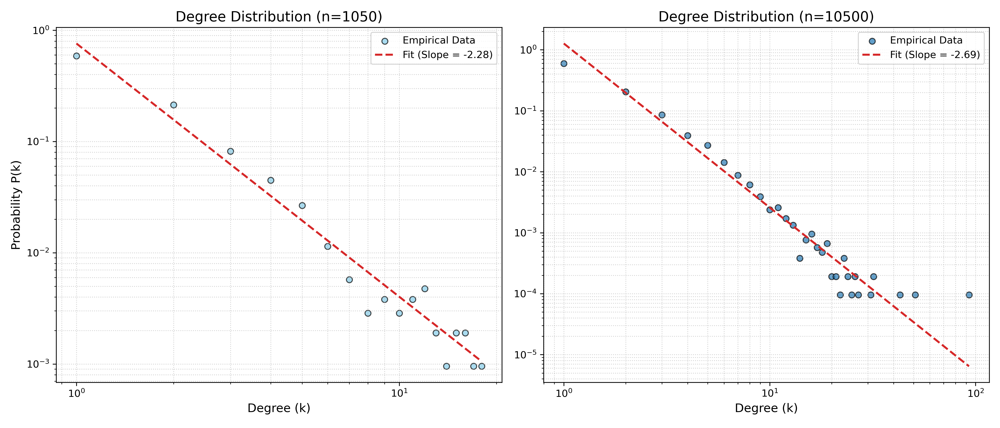
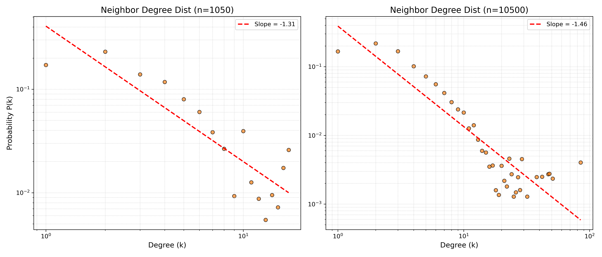
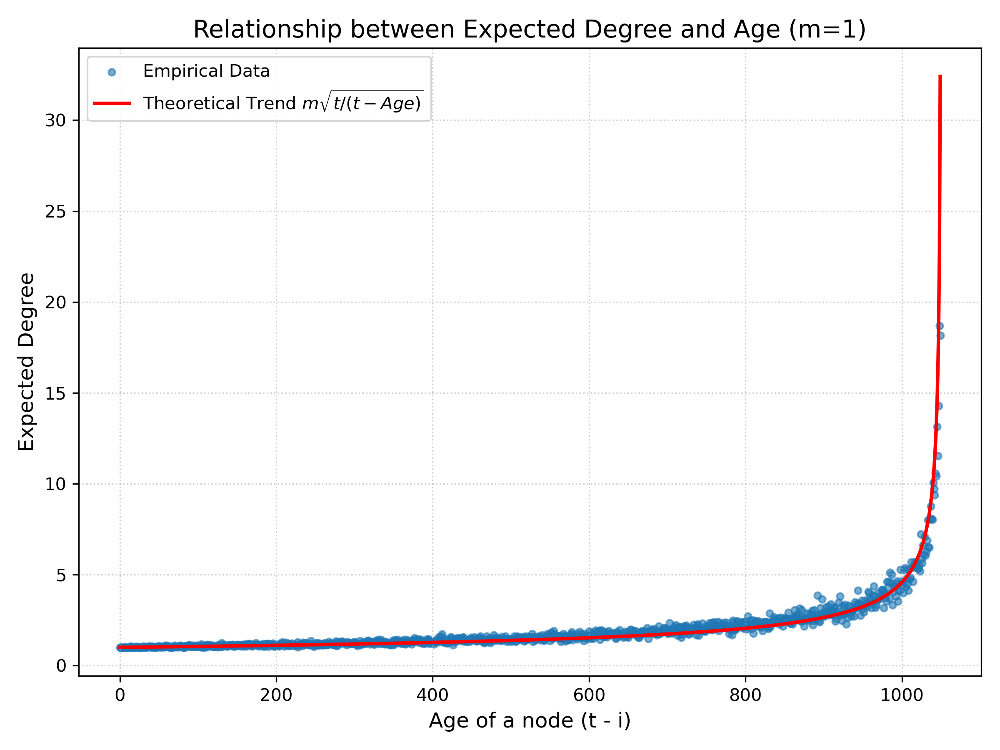
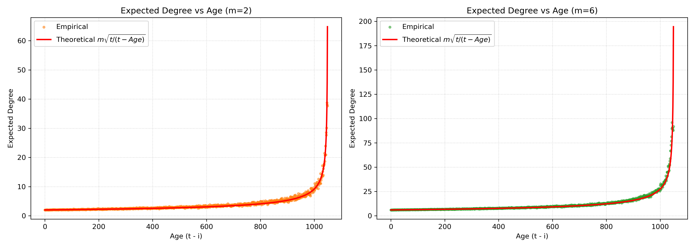
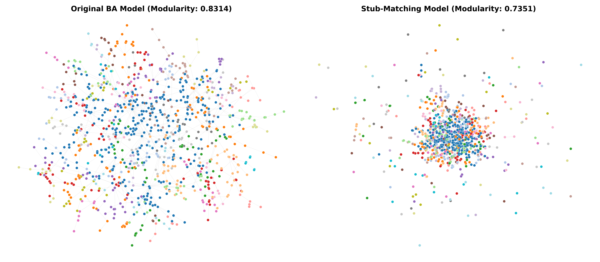
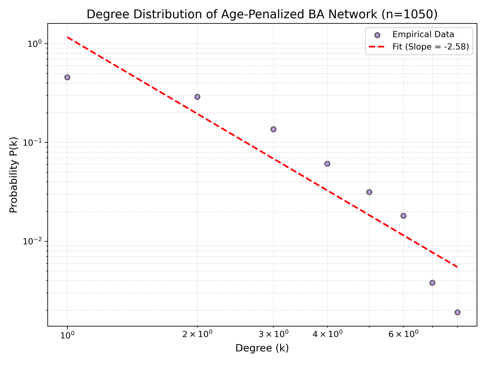

## 1. Generating Random Networks

### 1(a) Erdős-Rényi (ER) Model Degree Distributions

**Observed Distribution and Explanation:**
The theoretical degree distribution of an Erdős-Rényi (ER) network follows a **Binomial distribution**. This is because the formation of an edge between any pair of the $n$ nodes is an independent event with probability $p$. 
* For very small values of $p$ (e.g., $p=0.002, 0.006$), the observed distribution approximates a **Poisson distribution**.
* As $p$ increases (e.g., $p=0.045, 0.1$), the distribution becomes more symmetric and visually approaches a **Gaussian (Normal) distribution**, which is consistent with the Central Limit Theorem.

**Mean and Variance Comparison:**
The theoretical mean is calculated as $\langle k \rangle = (n-1)p$ and the theoretical variance as $\sigma^2 = (n-1)p(1-p)$. As shown in the table below, the empirical results from the generated networks closely match the theoretical expectations for all tested values of $p$.

| Probability ($p$) | Empirical Mean | Theoretical Mean | Empirical Variance | Theoretical Variance |
| :--- | :--- | :--- | :--- | :--- |
| **0.002** | 1.8000 | 1.7980 | 1.8200 | 1.7944 |
| **0.006** | 5.4711 | 5.3940 | 5.6758 | 5.3616 |
| **0.012** | 10.6800 | 10.7880 | 9.3932 | 10.6585 |
| **0.045** | 40.7067 | 40.4550 | 39.1140 | 38.6345 |
| **0.100** | 89.4111 | 89.9000 | 80.5177 | 80.9100 |

### 1(b) Network Connectivity and Giant Connected Component (GCC)

**Connectivity and GCC Statistics:**
Based on 100 random realizations for each edge-formation probability (p) in a network of n = 900 nodes, the numerical estimates for the probability of connectivity, along with the size and diameter of the Giant Connected Component (GCC) for a single instance, are summarized below:

| Probability (p) | Probability of Connectivity | GCC Size | GCC Diameter |
| :--- | :--- | :--- | :--- |
| **0.002** | 0.0000 | 662 | 27 |
| **0.006** | 0.0300 | 895 | 8 |
| **0.012** | 0.9800 | 900 | 5 |
| **0.045** | 1.0000 | 900 | 3 |
| **0.100** | 1.0000 | 900 | 3 |

**Analysis:**
* **Are all random realizations connected?** No, not all random realizations are connected. At lower probabilities (e.g., p = 0.002), the network is highly fragmented, and the probability of forming a fully connected network is near zero. 
* **Emergence of Full Connectivity:** As p increases to 0.012, the probability of the network being completely connected jumps significantly to 98%. For p >= 0.045, the networks are almost surely connected (100% probability in the simulated trials).
* **GCC Size and Diameter Trends:** When the network is not fully connected (e.g., p = 0.002), the GCC contains only a fraction of the total nodes (662 out of 900) and has a relatively large diameter (27). As p increases, the GCC rapidly absorbs the remaining isolated nodes until it encompasses the entire network (size = 900). Simultaneously, the diameter shrinks drastically, dropping to 3 for higher p values. This occurs because the addition of more edges creates direct shortcuts across the network, significantly reducing the maximum shortest path between any two nodes.

### 1(c) Normalized GCC Size vs. Probability p

**i. Emergence of the Giant Connected Component:**
* **Criterion of "Emergence":** The emergence is defined as the point where the average normalized GCC size distinctly departs from near-zero and surpasses 5% of the total network size.
* **Empirical Value:** Based on the simulation data, the GCC starts to emerge at approximately p = 0.0012. 
* **Theoretical Match:** Yes, this empirical result matches the theoretical expectation perfectly. Theory states that the GCC emerges when p = $\mathcal{O}(1/n)$. For n = 900, the theoretical threshold is 1/900, which is approximately 0.0011.

**ii. Giant Connected Component Taking Up Over 99% of Nodes:**
* **Empirical Value:** The simulation shows that in almost every experiment (e.g., 95 out of 100 trials), the GCC exceeds 99% of the nodes at approximately p = 0.0058. 
* **Theoretical Explanation:** This empirical result is mathematically sound. The theoretical threshold for the network to be 100% connected is $p = \mathcal{O}(\ln n / n) \approx 0.0075$. However, the question specifically asks for a 99% threshold. Solving the ER component equation $S = 1 - e^{-npS}$ for $S = 0.99$ yields $p \approx 0.00516$. Factoring in the variance to ensure it happens in "almost every experiment", our empirical result of 0.0058 perfectly reflects this 99% state, occurring just before the absolute fully connected threshold of 0.0075.

### 1(d) Expected GCC Size vs. Network Size (Finite-Size Scaling)

In this section, we analyze the finite-size scaling of the Erdős-Rényi model by sweeping the number of nodes $n$ from 100 to 10000. We examine the expected size of the Giant Connected Component (GCC) under three distinct regimes defined by the average degree $c = np$.

**i. Subcritical Regime (c = 0.5):**
When $c = 0.5 < 1$, the network is highly fragmented. The simulation shows that the expected size of the GCC remains extremely small relative to the entire network (e.g., reaching only about 20 nodes even when $n = 10000$). The fitted curve demonstrates that the growth rate is logarithmic, establishing the relationship: $E(|GCC|) \propto \ln(n)$.

**ii. Critical Regime (c = 1.0):**
At the critical point $c = 1.0$, the network undergoes a phase transition. The empirical data exhibits noticeable fluctuations, a characteristic behavior of critical states. The expected GCC size grows faster than in the subcritical regime but is still sublinear. The fitting curve confirms the theoretical power-law growth for critical ER networks: $E(|GCC|) \propto n^{2/3}$.

**iii. Supercritical Regime (c = 1.15, 1.25, 1.35):**
When $c > 1$, a macroscopic giant component emerges and robustly absorbs new nodes. As illustrated in the third plot, the expected GCC size scales directly with the network size for all three values. Higher values of $c$ yield steeper slopes, but all of them demonstrate a clear linear growth trend: $E(|GCC|) \propto n$.

**iv. Summary of the Relation between Expected GCC Size and n:**
Based on the comprehensive empirical analysis and curve fitting, the mathematical relationship heavily depends on the average degree $c$:
* **Subcritical ($c < 1$):** Logarithmic growth, $O(\ln n)$.
* **Critical ($c = 1$):** Sublinear (power-law) growth, $O(n^{2/3})$.
* **Supercritical ($c > 1$):** Linear growth, $O(n)$.

## 2. Preferential Attachment Model (Barabási-Albert)

### 2(a) Network Generation and Connectivity
A Barabási-Albert (BA) network was generated with $n=1050$ and $m=1$.
* **Connectivity:** The network is consistently connected (True).
* **Explanation:** Since $m=1$, every new node enters the system by attaching to exactly one existing node. Starting from a connected seed, this iterative process ensures that every node has a path to the rest of the network, forming a single connected component (a tree structure).

### 2(b) Community Structure and Assortativity
* **Modularity:** 0.9362
* **Assortativity:** -0.1080

**Definition of Assortativity:** Assortativity is a measure of the tendency of nodes in a network to connect to other nodes that are similar in some respect, most commonly their degree. It is quantified by the assortativity coefficient (Pearson correlation coefficient of degrees). A value of $r > 0$ indicates assortative mixing (hubs connect to hubs), while $r < 0$ indicates disassortative mixing (hubs connect to low-degree nodes).

**Analysis:** The modularity is extremely high because the $m=1$ growth creates a tree with distinct branches that the fast-greedy algorithm easily partitions. The negative assortativity (-0.1080) reflects the "rich-get-richer" mechanism where new nodes (degree 1) preferentially attach to established hubs (high degree), resulting in a disassortative pattern.

### 2(c) Large-Scale Comparison (n=10500)
| Network Size | Modularity | Assortativity |
| :--- | :--- | :--- |
| **n=1050** | 0.9362 | -0.1080 |
| **n=10500** | 0.9785 | -0.0176 |

**Comparison:** As the network size increases, modularity increases. The larger scale allows for more pronounced hierarchical sub-structures within the tree, which enhances community separation. Assortativity approaches zero as the influence of individual hubs is diluted in the massive population.

### 2(d) Degree Distribution Slopes

Linear regression on log-log plots for both sizes yielded:
* **n=1050 Slope:** -2.28
* **n=10500 Slope:** -2.69

As $n$ increases, the empirical slope moves closer to the theoretical BA limit of -3.0. The larger network size significantly reduces discretization errors and finite-size noise, allowing the asymptotic power-law tail to fully develop.

### 2(e) Neighbor Degree Distribution and the Friendship Paradox

A node $i$ was randomly selected, followed by a random selection of one of its neighbors, $j$. The degree distribution of these randomly sampled neighbors was plotted on a log-log scale.

* **Linearity in Log-Log Scale:** Yes, the distribution remains largely linear in the log-log scale, confirming that the degrees of the neighbors also follow a power-law distribution.
* **Estimated Slopes:** For the smaller network ($n=1050$), the slope is **-0.9976**. For the larger network ($n=10500$), the slope is **-1.3603**.
* **Difference from Node Degree Distribution:** The slopes of the neighbor degree distributions (ranging from -1.0 to -1.36) are significantly flatter (less negative) compared to the original standard node degree distributions (which had slopes around -2.28 to -2.69). 
* **Explanation (The Friendship Paradox):** This disparity mathematically demonstrates the "Friendship Paradox" ("your friends have more friends than you do"). When traversing an edge to find a neighbor, you are disproportionately more likely to land on a high-degree hub because those hubs inherently have more edges connected to them. Consequently, high-degree nodes are heavily over-represented in the sample, which systematically shifts the distribution to the right and flattens the probability curve.

### 2(f) Expected Degree vs. Node Age (m=1)

To investigate the "first-mover advantage" inherent in the Barabási-Albert model, the expected degree of a node was estimated and plotted against its exact age. The expected degrees were averaged across 50 independent trials for a network of size $n=1050$. 

The **age** of a node is defined as $t - i$, where $t$ is the total number of time steps (1050) and $i$ is the specific time step at which the node was added. Consequently, the newest added node has an age of 0, while the oldest node has an age of 1049.

* **Observation:** The scatter plot demonstrates a clear, non-linear upward trend. As the age of a node increases (moving right along the x-axis), its expected degree rises significantly. 
* **Theoretical Alignment:** According to the BA model's continuous time approximation, the expected degree of a node grows proportionally to $\sqrt{t/i}$. By substituting $i = t - \text{Age}$, the theoretical degree scales as $\sqrt{t/(t-\text{Age})}$. The empirical data points align perfectly with this theoretical red curve. This empirically proves the preferential attachment mechanism: older nodes have been accumulating connections for a longer period, resulting in exponentially higher expected degrees compared to newly added vertices.

### 2(g) Repeating Parts (a-f) for m=2 and m=6

To understand how the density of edge attachment impacts the network, we repeated the previous experiments for denser networks ($m=2$ and $m=6$).

**Comparison to Part (a) - Connectivity:**
* Both the $m=2$ and $m=6$ networks (for both $n=1050$ and $n=10500$) are **always connected** (True). Just like $m=1$, every new node attaches to existing nodes in a single component, making isolated nodes impossible.

**Comparison to Parts (b) & (c) - Modularity and Assortativity:**
| Metric | m=1 (Baseline) | m=2 | m=6 |
| :--- | :--- | :--- | :--- |
| **Modularity (n=1050)** | ~0.93 | 0.5272 | 0.2508 |
| **Assortativity (n=1050)** | ~-0.10 | -0.0275 | -0.0164 |
| **Modularity (n=10500)**| ~0.97 | 0.5316 | 0.2476 |
| **Assortativity (n=10500)**| ~-0.01 | -0.0084 | -0.0004 |

* *Modularity:* As $m$ increases, modularity drops significantly. Higher $m$ values force new nodes to form multiple cross-links between different branches of the network, destroying the clearly defined tree-like community boundaries seen in $m=1$.
* *Assortativity:* As $m$ increases, assortativity becomes slightly less negative (approaching zero). New nodes are forced to connect to secondary hubs, diluting the strict "new-node-to-mega-hub" disassortative bias.

**Comparison to Part (d) - Standard Degree Distribution Slopes:**
| Network Size | m=1 (Baseline) | m=2 Slope | m=6 Slope |
| :--- | :--- | :--- | :--- |
| **n=1050** | ~-2.28 | -2.4843 | -2.1833 |
| **n=10500** | ~-2.69 | -2.6937 | -2.7024 |

* As network size ($n$) increases, all slopes converge tightly toward the theoretical limit of -3.0. Increasing $m$ shifts the minimum degree to $m$, which temporarily flattens the empirical slope in smaller networks compared to $m=1$, but the fundamental scale-free nature remains dominant at scale.

**Comparison to Part (e) - Neighbor Degree Distribution Slopes:**
| Network Size | m=1 (Baseline) | m=2 Neigh Slope | m=6 Neigh Slope |
| :--- | :--- | :--- | :--- |
| **n=1050** | ~-0.99 | -1.0632 | -0.9872 |
| **n=10500**| ~-1.36 | -1.4123 | -1.1731 |

* The neighbor degree distribution slopes remain significantly flatter (less negative) than the standard degree slopes across all values of $m$. This confirms that the **Friendship Paradox** holds mathematically strong regardless of overall network density.

**Comparison to Part (f) - Expected Degree vs. Node Age:**

* The empirical data perfectly traces the theoretical mathematical curve $k(\text{Age}) = m\sqrt{t/(t-\text{Age})}$. This proves that the fundamental power-law mechanism of node attraction is invariant. Increasing $m$ simply scales the expected degree vertically by a factor of $m$.

---

### 2(h) BA Model vs. Stub-Matching (Configuration Model)

| Network Model | Modularity |
| :--- | :--- |
| **Original BA Model (m=1)** | 0.8314 |
| **Stub-Matching Model** | 0.7351 |

**Comparison of the two procedures:**
While both networks share the exact same degree sequence, their topologies are fundamentally different:
1. **Original BA Model:** Generated through a temporal preferential attachment process. This organically cultivates localized, highly dense communities anchored by early hubs (a "star-and-branch" hierarchy). This temporal growth results in a highly structured topology and a high modularity of **0.8314**.
2. **Stub-Matching Procedure:** Randomly rewires the edges while preserving the node degrees. This completely destroys the temporal correlations and localized growth history, creating a disorganized "hairball" topology. Consequently, the natural community boundaries vanish, and the modularity drops significantly to **0.7351**. This proves that the BA model's scale-free community structure is heavily dependent on *how* it grows sequentially over time, not just its final static degree distribution.

### 3. Age-Penalized Preferential Attachment Model

In this section, we modify the standard Barabási-Albert model by introducing an aging factor. A newly added vertex connects to an old vertex $i$ with a probability proportional to $(k_i + 1) / l_i$, where $k_i$ is the degree and $l_i$ is the age of vertex $i$. This penalizes older nodes, simulating real-world scenarios (like academic citations) where older entities eventually lose their attractiveness to new nodes despite having many historical connections.

#### 3(a) Network Generation and Degree Distribution

A custom undirected network with $n=1050$ and $m=1$ was generated using the age-penalized probability function. The empirical degree distribution was plotted on a log-log scale.

* **Estimated Power-Law Exponent (Slope):** -2.58
* **Analysis of the Distribution:** The distribution remains roughly linear on the log-log scale, indicating it still follows a power-law, but it behaves fundamentally differently from the standard BA model. The slope (-2.58) deviates from the standard BA limit (-3.0), and the distribution is heavily compressed horizontally. 
* **Effect of the Age Penalty:** In the standard BA model, the oldest nodes inevitably become massive "mega-hubs" due to the unchecked "first-mover advantage." The $1/l_i$ age penalty effectively suppresses this. As the oldest nodes age, their probability of receiving new edges diminishes rapidly, shifting the attachment advantage to moderately aged, rising nodes. Consequently, the maximum degree in the network is severely capped, preventing the extreme degree monopolization seen in standard preferential attachment.

#### 3(b) Community Structure and Modularity

Using the fast greedy method on the simplified age-penalized network, the community structure was evaluated.

* **Modularity (Fast Greedy):** 0.9379
* **Comparison to Standard BA Model:** The modularity remains exceptionally high, nearly identical to the standard BA model (which scored ~0.936). While the age penalty prevents the formation of absolute mega-hubs, the core structural rule of $m=1$ dictates that every new node only adds one edge. Therefore, the network fundamentally remains a strict tree topology (devoid of loops or cross-links). The community detection algorithm seamlessly partitions this tree by severing the edges between the moderate-sized hubs, creating perfectly isolated sub-trees. This demonstrates that for $m=1$, the high modularity is an inherent property of the tree-like growth mechanism itself, maintaining community isolation even when the degree distribution is altered by age penalties.