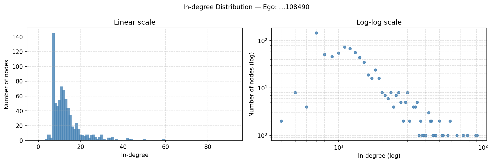
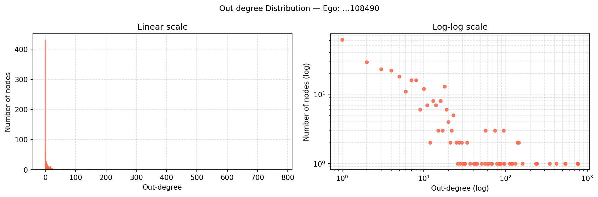
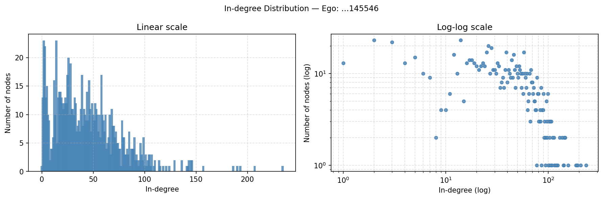
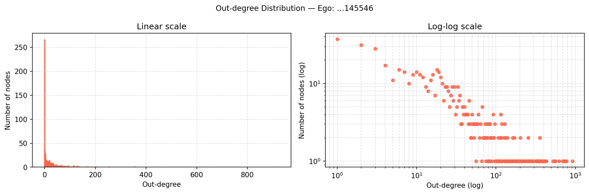
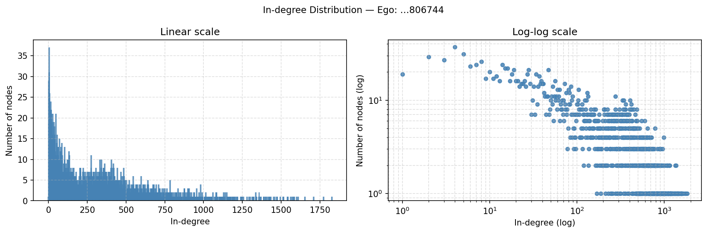
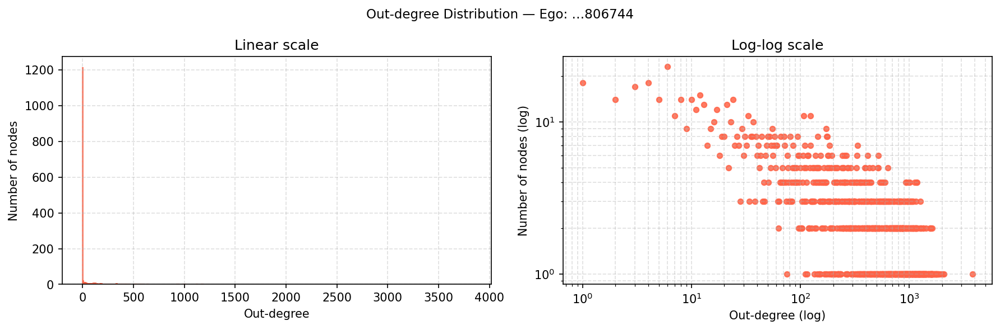
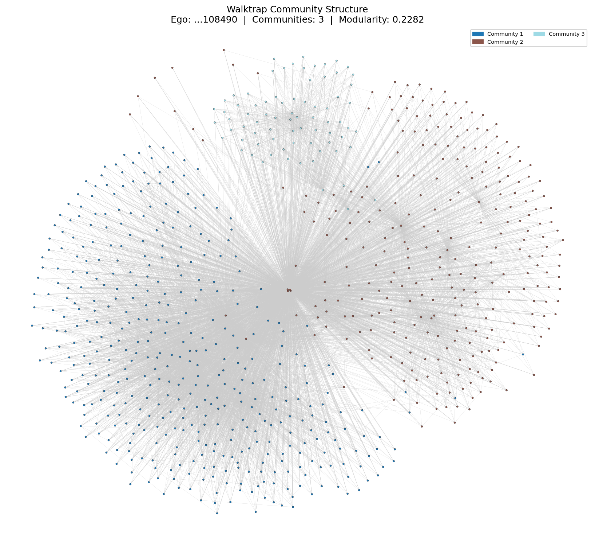
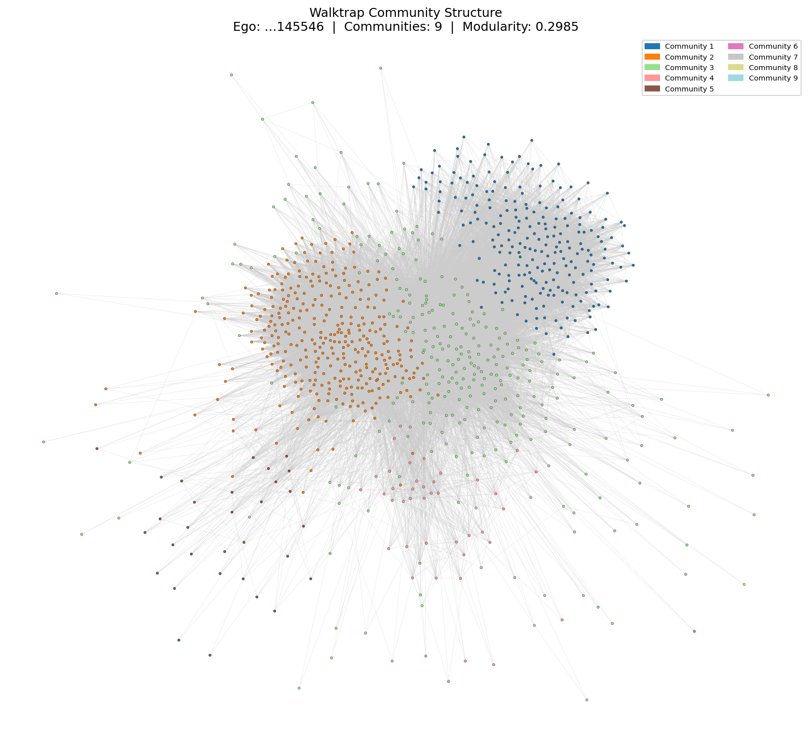
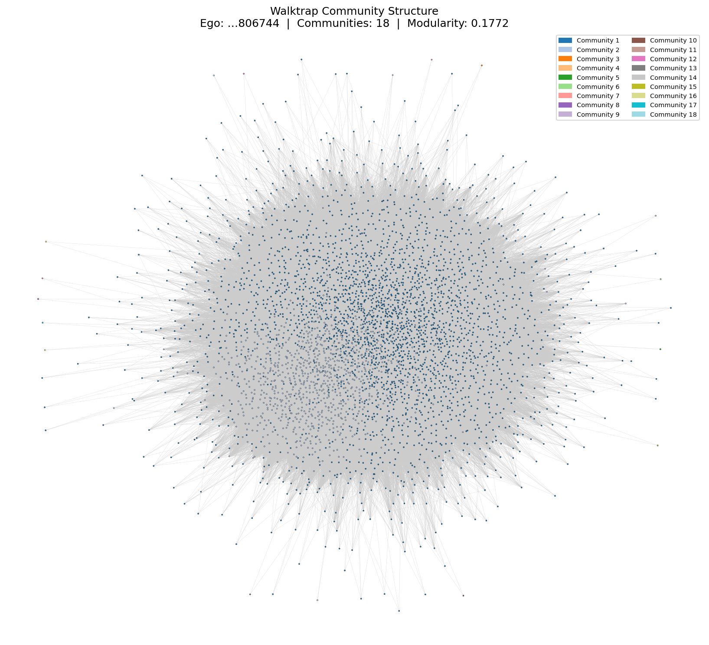

# Part 2 — Google+ Network

## Q18: Number of Personal Networks

Among all 132 ego nodes that have a `.circles` file in the dataset, we keep only those that satisfy **both** of the following conditions:

1. The ego node has **more than 2 circles** (strictly greater than 2).
2. The ego node has a corresponding `.edges` file.

After filtering, there are **57 personal networks**.

---

## Q19: In-degree and Out-degree Distributions

We build a directed personal network for each of the three specified ego nodes from the `.edges` file, which records directed edges among the ego node's contacts. Following the standard ego-network construction, the ego node itself is explicitly added to the graph with a directed edge from the ego node to every other node in the network (i.e., ego → neighbor for all neighbors). The basic statistics of the three networks are summarised below:

| Ego Node | Nodes | Edges (directed) | Avg In-degree | Max In-degree | Avg Out-degree | Max Out-degree |
|---|---|---|---|---|---|---|
| `109327480479767108490` | 774 | 10,884 | 14.06 | 91 | 14.06 | 773 |
| `115625564993990145546` | 924 | 40,323 | 43.64 | 234 | 43.64 | 923 |
| `101373961279443806744` | 3,815 | 1,137,321 | 298.12 | 1,826 | 298.12 | 3,814 |

Note: The average in-degree always equals the average out-degree by the directed graph identity $\sum_v \deg^+(v) = \sum_v \deg^-(v) = |E|$. The maximum out-degree equals $N - 1$ in each case, corresponding to the ego node which connects to every other node.

### Ego node `109327480479767108490`




### Ego node `115625564993990145546`




### Ego node `101373961279443806744`




### Do the personal networks have a similar in-degree and out-degree distribution?

**No.** Although the average in-degree and average out-degree are numerically equal for each network (a basic identity of directed graphs), their *distributions* are structurally very different within each network and across networks.

**In-degree** shows a right-skewed, heavy-tailed distribution in all three networks: most nodes receive very few incoming edges, while a small number of highly-followed nodes have much higher in-degrees. For `…108490`, the distribution peaks around degree 5–20 and tapers off to a maximum of 91. For `…145546`, it is more spread out with a right tail reaching 234. The largest network, `…806744`, has the widest spread, with in-degrees extending to 1,826, consistent with a heavier-tailed distribution driven by a large and diverse follower base.

**Out-degree** is also right-skewed but exhibits a distinctly different shape. The overwhelming majority of nodes have very low out-degrees (close to 0), producing an extreme spike at the left end of the linear-scale plot. The distribution then has an extremely long, flat tail. The dominant outlier in each network is the ego node itself, whose out-degree equals $N - 1$ (773, 923, and 3,814 respectively), placing it far to the right of all other nodes. This makes the linear-scale out-degree plot appear as a single tall bar near zero with one isolated point at the far right.

In summary, the in-degree and out-degree distributions are **not similar** within any individual network. In-degree is more broadly distributed across mid-range values with a gradual heavy tail, while out-degree is extremely concentrated near zero with one dominant hub (the ego node). This asymmetry reflects the structural role of the ego node in the personal network construction and the natural variation in how actively users follow others.

---

## Q20: Walktrap Community Detection

For each of the three personal networks from Q19, we apply the **Walktrap** community detection algorithm (random walk length = 4 steps). Since Walktrap requires an undirected graph, each directed personal network is first converted to its undirected counterpart by ignoring edge directions and collapsing parallel edges.

### Results Summary

| Ego Node | Nodes | Edges (undirected) | # Communities | Modularity | Top Community Sizes |
|---|---|---|---|---|---|
| `109327480479767108490` | 774 | 9,843 | 3 | 0.2282 | 419, 279, 76 |
| `115625564993990145546` | 924 | 34,945 | 9 | 0.2985 | 335, 280, 230, 43, 31, … |
| `101373961279443806744` | 3,815 | 958,395 | 18 | 0.1772 | 2,920, 879, 1, 1, … |

### Community Structure Plots

**Ego node `109327480479767108490`** (3 communities, modularity = 0.2282)



The three communities are visually well-separated in the force-directed layout. The two dominant communities (419 and 279 nodes) occupy the left and right halves of the graph respectively, while the smallest community (76 nodes) forms a distinct sub-cluster in the upper region. This clear spatial separation is consistent with the moderate modularity score of 0.2282, indicating genuine but not sharply defined community boundaries.

**Ego node `115625564993990145546`** (9 communities, modularity = 0.2985)



The layout reveals a densely connected core where the three largest communities (335, 280, and 230 nodes) are interleaved, surrounded by smaller peripheral groups visible as scattered coloured nodes. The highest modularity (0.2985) among the three networks reflects genuine subgroup structure. The three roughly equal-sized dominant communities suggest a balanced partitioning of the social network, while the smaller peripheral communities likely correspond to users who bridge between groups.

**Ego node `101373961279443806744`** (18 communities, modularity = 0.1772)



The network is extremely dense (958,395 undirected edges; average degree ≈ 502), and the visualisation appears as an almost entirely uniform mass. This is not a visualisation artifact but a direct consequence of the community structure: Community 1 alone contains 2,920 of 3,815 nodes (76.5%), and Community 2 contains 879 (23%). The remaining 16 communities are all singletons, whose coloured points are invisible at this scale. The low modularity (0.1772) confirms that community boundaries are weak when the graph is near-complete.

### Are the modularity scores similar?

**No.** The scores range from 0.1772 to 0.2985, a spread of approximately 0.12. The primary driver of this variation is **network density**: `…806744` has an average undirected degree of ≈ 502 compared to ≈ 25 and ≈ 76 for the other two. In a near-complete graph, random walks mix rapidly across the entire network, making it very difficult for the algorithm to identify distinct community boundaries, and resulting in a lower modularity.

---

## Q21: Meaning of Homogeneity and Completeness

**Homogeneity** ($h$) measures whether each detected community consists of members that all belong to the same circle. Formally:

$$h = 1 - \frac{H(C \mid K)}{H(C)}$$

$H(C \mid K)$ is the residual uncertainty about which circle a node belongs to, given that we already know its community assignment. If $h = 1$, every community is "pure" — all its members come from a single circle. If $h = 0$, knowing a node's community tells us nothing about its circle. A negative $h$ would mean communities are even more mixed than the overall circle distribution, i.e., the algorithm actively mixes circles together rather than keeping them separate.

**Completeness** ($c$) measures whether all members of the same circle are assigned to the same community. Formally:

$$c = 1 - \frac{H(K \mid C)}{H(K)}$$

$H(K \mid C)$ is the residual uncertainty about which community a node belongs to, given its circle. If $c = 1$, every circle is fully captured by a single community — no circle is split across multiple communities. If $c = 0$, knowing a node's circle tells us nothing about which community it lands in. A negative $c$ would mean circles are more fragmented across communities than a random assignment would produce.

Together, $h$ and $c$ are analogous to **precision and recall** in information retrieval: homogeneity reflects the internal purity of detected communities (each community should not mix different circles), while completeness reflects how well the algorithm keeps each circle intact (all members of a circle should end up in the same community).

---

## Q22: Homogeneity and Completeness for the 3 Personal Networks

The Walktrap communities from Q20 are used. Only nodes that appear both in the graph and in the `.circles` file are included in the computation. Each node is assigned to its first-appearing circle (first-occurrence rule) to handle overlapping circles. All entropy values are computed using the natural logarithm (nats).

| Ego Node | Circles | Nodes w/ label | Communities | $H(C)$ | $H(K)$ | $H(C\|K)$ | $H(K\|C)$ | $h$ | $c$ |
|---|---|---|---|---|---|---|---|---|---|
| `…108490` | 3 | 764 / 774 | 3 | 0.7735 | 0.9249 | 0.1632 | 0.3146 | **0.789** | **0.660** |
| `…145546` | 31 | 727 / 924 | 9 | 1.7719 | 1.0964 | 1.0633 | 0.3877 | **0.400** | **0.646** |
| `…806744` | 3 | 521 / 3,815 | 18 | 0.3667 | 0.5350 | 0.3617 | 0.5300 | **0.014** | **0.009** |

### Interpretation

**Ego node `…108490`** — $h = 0.789$, $c = 0.660$

This network shows the strongest alignment between communities and circles. With 3 circles and exactly 3 Walktrap communities, the algorithm found the same number of groups as the ground truth. The high homogeneity ($h \approx 0.789$) indicates that each detected community is largely pure — most members within a community share the same circle. The moderate completeness ($c \approx 0.660$) shows that each circle is mostly captured within one community, although some cross-community spillover exists. This is the only network where communities substantially mirror real-world social circles.

**Ego node `…145546`** — $h = 0.400$, $c = 0.646$

There are 31 circles but only 9 communities. Because many circles are merged into the same community, each community inevitably contains members from multiple circles, inflating $H(C \mid K)$ and suppressing homogeneity ($h \approx 0.400$). Completeness ($c \approx 0.646$) is more robust: many smaller circles happen to fall largely within one community even after merging, so the circle structure is partially preserved. The gap between $h$ and $c$ of ≈ 0.25 is a signature of having more fine-grained ground-truth labels than detected communities — the communities are too coarse to be pure, but still manage to keep most circles roughly intact.

**Ego node `…806744`** — $h = 0.014$, $c = 0.009$

Both scores are near zero, indicating essentially no correspondence between Walktrap communities and ground-truth circles. Two factors explain this result. First, only 521 of 3,815 nodes (13.7%) have circle labels, so the labelled set covers a small and potentially unrepresentative slice of the network. Second, the Walktrap algorithm produced 18 communities, but two of them dominate (2,920 and 879 nodes), meaning the 521 labelled nodes covering just 3 circles are scattered across these two giant communities with no coherent alignment. The $H(C)$ value of 0.367 is relatively small, confirming that the circle distribution itself is highly unbalanced, further reducing the sensitivity of the $h$ and $c$ metrics.

### Are there negative values?

No negative values were observed. Negative $h$ or $c$ would require the conditional entropy to exceed the marginal entropy — i.e., knowing a node's community (or circle) would actively increase uncertainty about its circle (or community). This pathological case does not arise here because we compute $b_i$ (the community size used in $H(K)$ and $H(C \mid K)$) using only the labelled nodes, ensuring that all three quantities $N$, $a_i$, and $b_i$ refer to the same population and the entropy formulas remain mathematically consistent. In theory, negative values could arise if the algorithm systematically anti-correlates with ground-truth partitions, or if entropy estimates become unreliable due to an extremely small labelled subset. Neither condition holds for these three networks.

---

# Part 3 — Cora Dataset

## Q23: Graph Convolutional Network (GCN)

### Model Architecture

We implement a flexible GCN following Kipf & Welling (2017), where each layer performs the aggregation:

$$H^{(l+1)} = \sigma\!\left(\tilde{D}^{-\frac{1}{2}}\tilde{A}\tilde{D}^{-\frac{1}{2}} H^{(l)} W^{(l)}\right)$$

with $\tilde{A} = A + I$ the self-loop adjacency matrix and $\tilde{D}$ its diagonal degree matrix. The final layer uses log-softmax for multi-class classification, trained with negative log-likelihood loss on the 140 labelled seed nodes.

### Hyperparameter Search

We perform a grid search over 22 configurations, varying number of layers (2–4), hidden dimensions (16 / 64 / 128 / 256), dropout rate (0.3 / 0.5), learning rate (0.005 / 0.01), and weight decay ($5\times10^{-4}$ / $10^{-3}$). All runs use the Adam optimiser. Training runs for up to 500 epochs with early stopping (patience = 100) based on validation accuracy.

| Architecture | L | Dropout | LR | WD | Val Acc | Test Acc |
|---|---|---|---|---|---|---|
| 1433→16→7 | 2 | 0.5 | 0.010 | 5e-4 | 0.7840 | 0.8060 |
| 1433→64→7 | 2 | 0.5 | 0.010 | 5e-4 | 0.7920 | 0.8090 |
| 1433→128→7 | 2 | 0.5 | 0.010 | 5e-4 | 0.7860 | 0.8030 |
| 1433→256→7 | 2 | 0.5 | 0.010 | 5e-4 | 0.8060 | 0.8170 |
| 1433→64→7 | 2 | 0.3 | 0.010 | 5e-4 | 0.7900 | 0.7980 |
| 1433→128→7 | 2 | 0.3 | 0.010 | 5e-4 | 0.7860 | 0.8050 |
| 1433→64→7 | 2 | 0.5 | 0.005 | 5e-4 | 0.7900 | 0.7990 |
| 1433→128→7 | 2 | 0.5 | 0.005 | 5e-4 | 0.7940 | 0.8060 |
| 1433→64→7 | 2 | 0.5 | 0.010 | 1e-3 | 0.7920 | 0.8100 |
| 1433→128→7 | 2 | 0.5 | 0.010 | 1e-3 | 0.7900 | 0.8080 |
| 1433→64→32→7 | 3 | 0.5 | 0.010 | 5e-4 | 0.7880 | 0.8050 |
| 1433→64→64→7 | 3 | 0.5 | 0.010 | 5e-4 | 0.8000 | 0.8120 |
| 1433→128→64→7 | 3 | 0.5 | 0.010 | 5e-4 | 0.7940 | 0.8110 |
| 1433→128→64→7 | 3 | 0.3 | 0.010 | 5e-4 | 0.8040 | 0.8100 |
| 1433→64→64→7 | 3 | 0.3 | 0.010 | 5e-4 | 0.7920 | 0.7850 |
| 1433→64→64→7 | 3 | 0.5 | 0.005 | 5e-4 | 0.8120 | 0.8160 |
| 1433→128→64→7 | 3 | 0.5 | 0.005 | 5e-4 | 0.7940 | 0.8200 |
| 1433→64→64→7 | 3 | 0.5 | 0.010 | 1e-3 | 0.8020 | 0.8110 |
| 1433→64→64→32→7 | 4 | 0.5 | 0.010 | 5e-4 | 0.7900 | 0.8210 |
| 1433→64→64→64→7 | 4 | 0.5 | 0.010 | 5e-4 | 0.7880 | 0.8150 |
| **1433→128→64→32→7** | **4** | **0.5** | **0.010** | **5e-4** | **0.8180** | **0.8180** |
| 1433→64→64→32→7 | 4 | 0.3 | 0.010 | 5e-4 | 0.8020 | 0.8070 |

### Best Configuration

The best model is a **4-layer GCN** (three hidden layers: 128 → 64 → 32) with dropout 0.5 and learning rate 0.01:

- **Validation accuracy: 81.80%**
- **Test accuracy: 81.80%**

```
Architecture     : 1433 → 128 → 64 → 32 → 7
Dropout          : 0.5
Learning rate    : 0.01
Weight decay     : 5 × 10⁻⁴
Optimiser        : Adam
Number of layers : 4 (including output layer)
```

The bottleneck architecture (128 → 64 → 32) provides a hierarchical feature compression across 3-hop neighbourhoods. Each additional GCN layer aggregates information from one further hop, so a 4-layer network captures longer-range citation dependencies that a 2-layer network cannot. The decreasing hidden dimensions regularise the model by forcing it to compress representations progressively, which helps generalise from the small training set of 140 nodes.

### Per-class Classification Report (Best Model)

| Class | Precision | Recall | F1 | Support |
|---|---|---|---|---|
| 0 — Case Based | 0.7561 | 0.7154 | 0.7352 | 130 |
| 1 — Genetic Algorithms | 0.6810 | 0.8681 | 0.7633 | 91 |
| 2 — Neural Networks | 0.8944 | 0.8819 | 0.8881 | 144 |
| 3 — Probabilistic Methods | 0.8904 | 0.8150 | 0.8511 | 319 |
| 4 — Reinforcement Learning | 0.8400 | 0.8456 | 0.8428 | 149 |
| 5 — Rule Learning | 0.7879 | 0.7573 | 0.7723 | 103 |
| 6 — Theory | 0.7051 | 0.8594 | 0.7746 | 64 |
| **Macro avg** | **0.7936** | **0.8204** | **0.8039** | **1000** |
| **Weighted avg** | **0.8245** | **0.8180** | **0.8191** | **1000** |
| **Overall accuracy** | | | **0.8180** | **1000** |

Neural Networks achieves the highest F1 (0.888), likely because its papers form a dense and well-separated citation cluster with distinctive vocabulary. Genetic Algorithms has the lowest precision (0.681), indicating that its walks spread broadly and claim nodes from adjacent classes. Case Based and Rule Learning have the next lowest F1 scores, suggesting their citation patterns and text features overlap more with other classes.

---

## Q24: Node2Vec + Classifier

### How Node2Vec Finds Node Features

Node2Vec learns low-dimensional node embeddings by simulating biased random walks on the graph and training a skip-gram model (Word2Vec) on the resulting walk sequences. At each step of a walk currently at node $v$ (having arrived from $t$), the transition probability to the next node $x$ is:

$$\pi_{vx} = \alpha_{pq}(t, x) \cdot w_{vx}$$

where $\alpha_{pq}$ depends on the distance $d_{tx}$ between $x$ and the previous node $t$:

$$\alpha_{pq}(t, x) = \begin{cases} 1/p & \text{if } d_{tx} = 0 \text{ (return to } t\text{)} \\ 1 & \text{if } d_{tx} = 1 \text{ (stay local)} \\ 1/q & \text{if } d_{tx} = 2 \text{ (explore further)} \end{cases}$$

- **Return parameter $p$**: small $p$ encourages revisiting recent nodes (DFS-like, captures structural roles).
- **In-out parameter $q$**: small $q$ favours local exploration (BFS-like, captures community membership).

In our implementation we use $p = q = 1$ (unbiased DeepWalk-style walk), embedding dimension 128, walk length 80, 10 walks per node, and window size 10. The skip-gram model predicts surrounding nodes in a walk, so nodes that frequently co-occur in walks receive similar embedding vectors.

### Classification Results

We evaluate three classifiers (Random Forest, SVM with RBF kernel, MLP) on three feature sets. SVM and MLP inputs are standardised with zero mean and unit variance.

| Feature Set | Classifier | Accuracy | Macro F1 |
|---|---|---|---|
| Node2Vec only (128-d) | Random Forest | 70.50% | 0.6921 |
| Node2Vec only (128-d) | **SVM (RBF)** | **74.50%** | **0.7371** |
| Node2Vec only (128-d) | MLP | 70.40% | 0.7017 |
| Text only (1433-d) | Random Forest | 57.50% | 0.5656 |
| Text only (1433-d) | SVM (RBF) | 45.40% | 0.4580 |
| Text only (1433-d) | MLP | 35.00% | 0.3551 |
| **Node2Vec + Text (1561-d)** | **Random Forest** | **72.90%** | **0.7201** |
| Node2Vec + Text (1561-d) | SVM (RBF) | 67.80% | 0.6904 |
| Node2Vec + Text (1561-d) | MLP | 49.60% | 0.4868 |

### Which Feature Set Outperforms?

**Node2Vec outperforms text-only features across all three classifiers.** The best single-feature accuracy is:
- Node2Vec only: **74.50%** (SVM)
- Text only: **57.50%** (Random Forest)

### Why Does Node2Vec Outperform Text Features?

The key reason is the extreme mismatch between training set size and feature dimensionality. With only **140 labelled nodes** and **1433-dimensional sparse binary features**, all three classifiers suffer from the curse of dimensionality:

- **MLP** with 1433-dimensional input and only 140 training samples is severely under-constrained, achieving only 35% accuracy — barely above a naive majority-class baseline. This is a textbook case of overfitting due to insufficient data.
- **SVM** cannot reliably estimate a large-margin decision boundary in 1433 dimensions from 140 examples, falling to 45.4%.
- **Random Forest** is more robust to high dimensions but still limited to 57.5% because the 1433-dimensional binary bag-of-words vectors are extremely sparse, providing weak signal per feature.

Node2Vec embeddings (128-d, dense, continuous) are far better conditioned for small-sample learning. The random walks compress graph structure into a compact representation where citation proximity — a strong proxy for topic similarity — is encoded geometrically, providing an inductive bias well-aligned with the classification task. All 2708 nodes participate in walk generation regardless of label availability, so the 128-d embeddings capture global graph structure using the full graph, not just the 140 labelled nodes.

### Best Classification Accuracy

The best result is **74.50%** using Node2Vec only with an SVM (RBF) classifier. Combining Node2Vec with text features (Node2Vec + Text, Random Forest) yields 72.90%, which is actually lower than Node2Vec alone. This confirms that in the low-data regime, the high-dimensional sparse text features add more noise than discriminative signal, diluting the informative 128-d Node2Vec embedding and hurting the classifier.

**Best classification accuracy: 74.50%** (Node2Vec only, SVM with RBF kernel).

---

## Q25: Personalized PageRank

### Method

We run personalized PageRank as a biased random walk on the **Giant Connected Component (GCC)** of the Cora citation graph (2,485 nodes, 5,069 edges after converting to undirected). 18 of the 140 training seed nodes fall outside the GCC, leaving 122 GCC seed nodes. Similarly, 85 of the 1,000 test nodes are outside the GCC; we evaluate on the remaining 915 GCC test nodes. For each of the 7 classes, we launch 1,000 random walks from each seed node of that class (122,000 total walks). Each walk has length 100 steps.

At every step from the current node $x_0$ with neighbours $x_1, \ldots, x_k$:

- With probability $\alpha$: **teleport** to a uniformly random seed node of the current class.
- With probability $1 - \alpha$: **transition** to neighbour $x_i$ with probability proportional to the softmax of dot-product similarity between text features:

$$p_i = \frac{\exp(x_0 \cdot x_i)}{\sum_{j=1}^{k} \exp(x_0 \cdot x_j)}$$

We maintain a class-wise visit counter for every node. The predicted label for an unlabelled node is the class whose walks visited it most often. Nodes that receive zero visits across all classes are assigned the majority class of the GCC training set. We vary $\alpha \in \{0, 0.1, 0.2\}$.

### Results

| $\alpha$ | Accuracy | Macro F1 | Weighted F1 | Zero-visit nodes |
|---|---|---|---|---|
| **0.0** | **69.40%** | **0.6825** | **0.6936** | 23 |
| 0.1 | 67.32% | 0.6642 | 0.6712 | 38 |
| 0.2 | 66.12% | 0.6563 | 0.6562 | 51 |

### Per-class Results

**α = 0.0**

| Class | Precision | Recall | F1 | Support |
|---|---|---|---|---|
| 0 — Case Based | 0.5682 | 0.5906 | 0.5792 | 127 |
| 1 — Genetic Algorithms | 0.5342 | 0.8764 | 0.6638 | 89 |
| 2 — Neural Networks | 0.7688 | 0.8723 | 0.8173 | 141 |
| 3 — Probabilistic Methods | 0.8571 | 0.5512 | 0.6710 | 283 |
| 4 — Reinforcement Learning | 0.7444 | 0.7615 | 0.7529 | 130 |
| 5 — Rule Learning | 0.7353 | 0.7576 | 0.7463 | 99 |
| 6 — Theory | 0.4833 | 0.6304 | 0.5472 | 46 |
| **Weighted avg** | **0.7240** | **0.6940** | **0.6936** | **915** |

**α = 0.1**

| Class | Precision | Recall | F1 | Support |
|---|---|---|---|---|
| 0 — Case Based | 0.5429 | 0.5984 | 0.5693 | 127 |
| 1 — Genetic Algorithms | 0.5524 | 0.8876 | 0.6810 | 89 |
| 2 — Neural Networks | 0.6872 | 0.8723 | 0.7688 | 141 |
| 3 — Probabilistic Methods | 0.8868 | 0.4982 | 0.6380 | 283 |
| 4 — Reinforcement Learning | 0.7348 | 0.7462 | 0.7405 | 130 |
| 5 — Rule Learning | 0.7447 | 0.7071 | 0.7254 | 99 |
| 6 — Theory | 0.4412 | 0.6522 | 0.5263 | 46 |
| **Weighted avg** | **0.7164** | **0.6732** | **0.6712** | **915** |

**α = 0.2**

| Class | Precision | Recall | F1 | Support |
|---|---|---|---|---|
| 0 — Case Based | 0.5748 | 0.5748 | 0.5748 | 127 |
| 1 — Genetic Algorithms | 0.5563 | 0.8876 | 0.6840 | 89 |
| 2 — Neural Networks | 0.6294 | 0.8794 | 0.7337 | 141 |
| 3 — Probabilistic Methods | 0.8627 | 0.4664 | 0.6055 | 283 |
| 4 — Reinforcement Learning | 0.7480 | 0.7308 | 0.7393 | 130 |
| 5 — Rule Learning | 0.7216 | 0.7071 | 0.7143 | 99 |
| 6 — Theory | 0.4444 | 0.6957 | 0.5424 | 46 |
| **Weighted avg** | **0.7044** | **0.6612** | **0.6562** | **915** |

### Interpretation

**Effect of teleportation probability $\alpha$:**
Accuracy decreases monotonically as $\alpha$ increases: 69.40% → 67.32% → 66.12%. The number of zero-visit test nodes also increases with $\alpha$ (23 → 38 → 51). Higher $\alpha$ forces walks to return to seed nodes more frequently after each step, which restricts the walk to the local neighbourhood of the seeds rather than propagating label information broadly through the graph. With $\alpha = 0$, the walk propagates freely through content-similarity-biased transitions, visiting a wider portion of the graph and classifying more test nodes correctly. This suggests that for Cora, the text-similarity-based transition probabilities alone provide sufficient directional signal for label propagation without requiring artificial teleportation to anchor the walk.

**Class-level observations:**

- **Neural Networks** (class 2) is the most accurately classified class across all $\alpha$ values (recall > 87%), reflecting a dense and topically coherent citation cluster whose text features strongly guide walks toward it.
- **Probabilistic Methods** (class 3) shows high precision but very low recall (55.1% at $\alpha=0$, declining to 46.6% at $\alpha=0.2$). As the largest class (283 test nodes), its nodes are spread across a large graph region; walks from its 18 seeds are too sparse to cover all its test nodes, so many are claimed by neighbouring classes instead.
- **Theory** (class 6) consistently scores lowest in F1 (0.547 at $\alpha=0$) due to having only 10 seed nodes in the GCC — half of other classes — generating fewer total walk visits and therefore a weaker label signal.
- **Genetic Algorithms** (class 1) achieves high recall (87–89%) but low precision (~54%), indicating its walks spread broadly and capture most true positives while also incorrectly claiming nodes from adjacent classes.

### Comparison of All Three Methods

| Method | Test Accuracy |
|---|---|
| **GCN (4-layer, best config)** | **81.80%** |
| Node2Vec only, SVM (RBF) | 74.50% |
| Node2Vec + Text, Random Forest | 72.90% |
| Personalized PageRank ($\alpha=0$) | 69.40% |
| Text only, Random Forest | 57.50% |

GCN achieves the highest accuracy because it jointly leverages both graph structure and text features through end-to-end differentiable message passing, directly supervised by the 140 labelled nodes. Node2Vec + classifier separates feature learning from classification and cannot propagate label information through the graph at test time, but its compact structural embedding still outperforms raw text features in the low-data regime. Personalized PageRank requires no model training but relies entirely on graph topology and text similarity for propagation, making it the most interpretable method despite its lower accuracy. Text-only classifiers perform worst due to the curse of dimensionality: 1433-dimensional sparse features are too high-dimensional to be learned reliably from only 140 labelled examples.