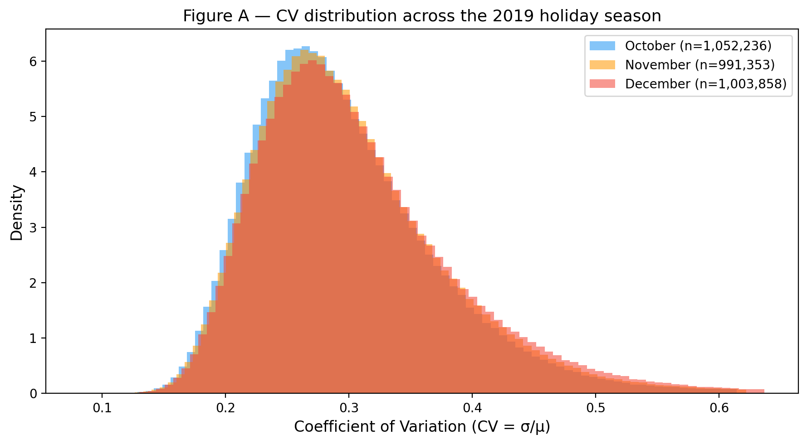
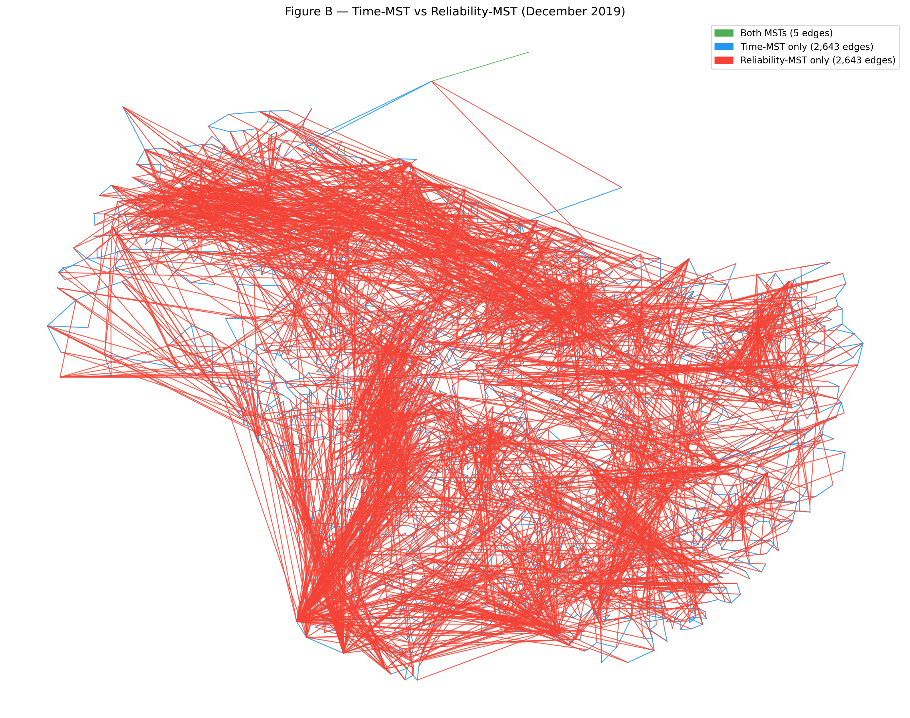
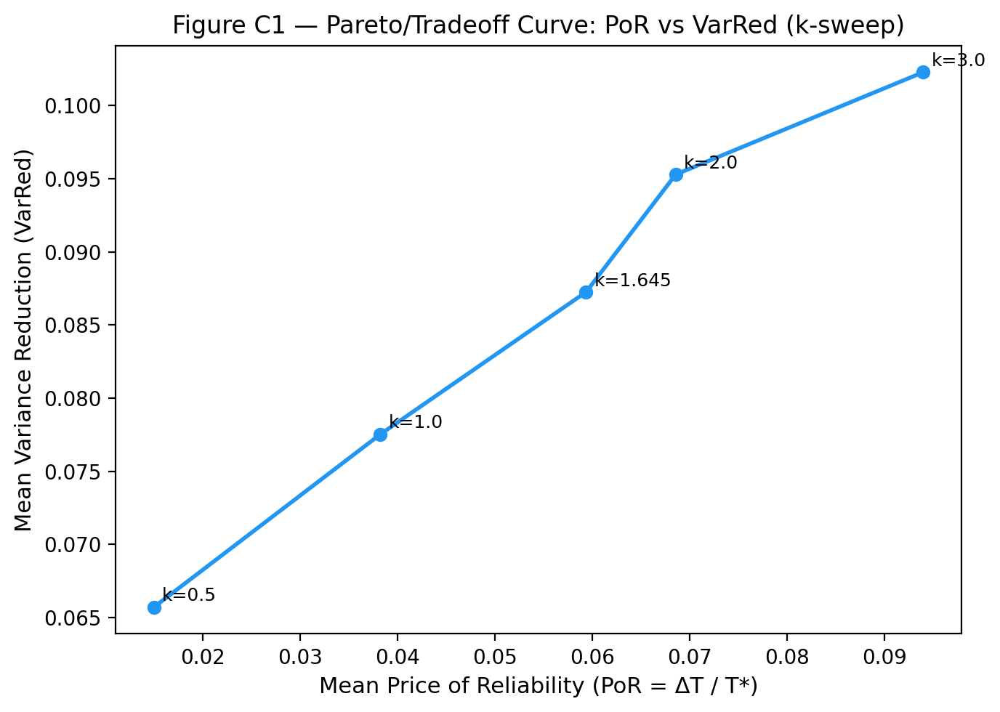
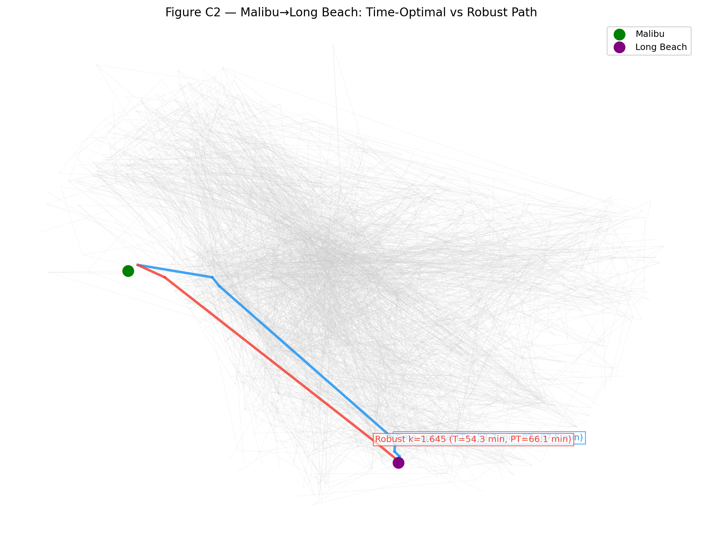
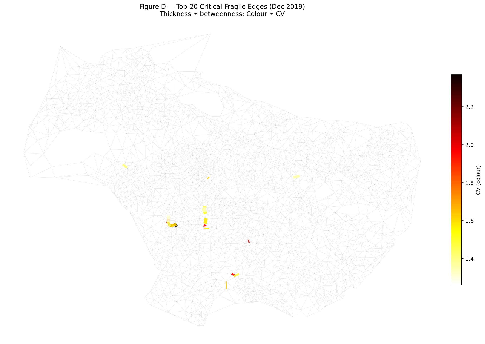

# Q25 — Reliable Routes for Santa: A Travel-Time Reliability Network of LA (Oct–Dec 2019)

---

## Motivation

In Part 2 we minimised average travel **time**. But a gift-delivery operation does not care only about the *mean* trip — it cares about *predictability*. A route that is usually 10 min but occasionally 40 min is worse than one that is reliably 15 min, because Santa must hit delivery windows. The Uber Movement quarterly file for Q4 2019 (months 10, 11, 12) contains a column ignored by Q9–Q24 — `standard_deviation_travel_time` — which measures how much each origin–destination travel time fluctuates within the month. We use it to build a **reliability network**, define reliability-aware routing, and study how LA's road network becomes *less predictable* across the 2019 holiday season (October baseline → November Thanksgiving → December Christmas shopping). The same data file satisfies the project's ≥ 3-months requirement with no new download.

---

## Definitions

For each month m ∈ {10, 11, 12} we build the cleaned undirected graph exactly as in Q9 (largest connected component; merge A→B and B→A edges). Each undirected edge e = (i, j) carries:

- **μ_e** = mean travel time (seconds) — same quantity as the Q9 weight.  
- **σ_e** = combined std: `σ_e = √((σ_AB² + σ_BA²) / 4)` (std of the average of two independent estimates; if only one direction exists, keep its sigma as-is).  
- **CV_e** = σ_e / μ_e (coefficient of variation; the *unreliability weight*).

**Mean-risk edge cost** with risk-aversion parameter k ≥ 0:  
`c_e(k) = μ_e + k·σ_e`  
Routing with this additive cost via Dijkstra yields the **robust shortest path P_k**. Default k = 1.645 (one-sided 95th pct under a normal approximation, i.e., a "95% on-time" buffer).

**Path-level statistics** for path P (edges treated as *independent* within the month — a simplifying assumption since traffic on consecutive road segments within a trip is correlated in reality, but monthly aggregates lack the trip-level covariance structure to do better):

| Quantity | Formula |
|---|---|
| Mean travel time | T(P) = Σ μ_e |
| Variance | Var(P) = Σ σ_e² |
| Std | S(P) = √Var(P) |
| Planning time | PT(P, k) = T(P) + k·S(P) |

**Note on additive cost vs. true planning time:** The Dijkstra edge weight `c_e = μ + k·σ` selects the path that minimises `Σ(μ + k·σ) = T + k·Σσ`. The *true* planning time is `T + k·√(Σσ²)`. Because `Σσ ≥ √(Σσ²)` (arithmetic sum ≥ quadratic sum), the additive cost is a conservative upper bound on the true PT. We use the additive cost *only to select the path* and then recompute the exact T, Var, S, PT from the chosen edges.

**Price of Reliability** for an OD pair, comparing the time-optimal path P* (min Σμ) to the robust path P_k (min Σc_e(k)):

| Metric | Formula | Interpretation |
|---|---|---|
| PoR | (T(P_k) − T(P*)) / T(P*) | Extra average time paid for reliability |
| VarRed | 1 − Var(P_k) / Var(P*) | Fraction of variance bought back |
| PTgain | (PT(P*, k) − PT(P_k, k)) / PT(P*, k) | Reduction in planning/budgeted time |

---

## Sub-task (a) — CV Distribution Across the Season

**Procedure:** Build G_time^m and G_rel^m for each month. Compute per-edge CV. Report seasonal statistics. Median speed is computed on the Delaunay-induced subgraph (same edge scope as Q15). Plot overlaid histograms.

### Answer

**Table A1 — Seasonal statistics (each month's full graph)**

| Month | #nodes | #edges | Mean μ (s) | Median speed (mph) | Mean CV | Median CV | 90th-pct CV |
|---|---|---|---|---|---|---|---|
| October | 2,652 | 1,052,236 | 1,594 | 16.91 | 0.3009 | 0.2846 | 0.4010 |
| November | 2,651 | 991,353 | 1,513 | 17.21 | 0.3061 | 0.2894 | 0.4100 |
| December | 2,649 | 1,003,858 | 1,497 | 17.26 | 0.3108 | 0.2927 | 0.4201 |

**Table A2 — Restricted to the 942,301 edges present in all 3 months (fair month comparison)**

| Month | #edges (∩) | Mean CV (∩) | Median CV (∩) | 90th-pct CV (∩) |
|---|---|---|---|---|
| October | 942,301 | 0.2995 | 0.2825 | 0.3988 |
| November | 942,301 | 0.3052 | 0.2883 | 0.4085 |
| December | 942,301 | 0.3094 | 0.2911 | 0.4177 |

*Figure A: Overlaid histograms of edge CV for October (blue), November (orange), and December (red). All three distributions are right-skewed; the mode and tail both shift right Oct → Dec.*

### Interpretation

**Hypothesis confirmed:** The CV distribution shifts right and its tail thickens November → December. Across the edge intersection (same 942,301 OD pairs), the mean CV rises from 0.2995 in October to 0.3094 in December (+0.0099, +3.3%). Crucially, the 90th-percentile CV rises by +0.0189 relative to the October baseline — a 4.7% increase concentrated in the tail — while mean travel time *decreases* (1,594 s → 1,497 s, −6.1%) and mean std also falls (469 s → 459 s, −2.1%). This confirms the key claim: **mean travel time falls faster than mean std during the shopping season**, so the relative variability CV = σ/μ rises — LA roads become simultaneously faster on average (perhaps due to changed commuting patterns in December) but *more erratic relative to their typical speed*. The 90th-pct CV reaching 0.42 in December means the top 10% most-unreliable roads have a coefficient of variation of 42%, implying a trip on those roads that averages 10 min has a standard deviation of over 4 min.

---

## Sub-task (b) — Reliability-MST vs Time-MST (December)

**Procedure:** For December, compute `MST(G_time)` (minimum spanning tree under μ) and `MST(G_rel)` (MST under CV). Report total costs, highest-degree hub, and Jaccard edge-set overlap.

### Answer

**Table B — MST comparison**

| MST | Total cost | Highest-degree hub | Hub degree | Jaccard with other |
|---|---|---|---|---|
| Time-MST | 269,085 s | Census Tract 408703 | 6 | 0.0009 |
| Reliability-MST | 422.91 CV | Census Tract 670328 | 91 | 0.0009 |

**Edge membership:** Both MSTs share only **5 edges** out of 2,648. Only-time: 2,643 edges. Only-reliability: 2,643 edges.

*Figure B: Time-MST (blue), Reliability-MST (red), shared edges (green). Only 5 green edges are visible — the two trees are almost entirely disjoint.*

### Interpretation

The **Jaccard overlap of 0.0009** is striking: the two spanning trees share only 5 out of 5,291 combined edges. This shows that **speed and reliability are nearly orthogonal objectives** in LA's road network. The time-MST connects tracts via fast but often congestion-prone corridors (its hub has degree 6, typical of a balanced geographic tree); the reliability-MST chains tracts via *consistent* local roads, resulting in a star-like hub of degree 91 — a single highly-accessible, low-variance tract (Census Tract 670328) anchors nearly 4% of all reliability-optimal connections. This is the reliability analogue of the Part-1 vine cluster: rather than geographic proximity, the reliability-MST organises tracts by *consistency*, with the hub tract acting as a "reliability interchange." The near-zero Jaccard also means that any analysis restricted to the time-MST backbone would miss virtually all the reliability-efficient corridors, and vice versa — the two networks live in almost entirely different parts of the edge set.

---

## Sub-task (c) — Price of Reliability

**Procedure:** Compute the time-optimal path P* (min-μ Dijkstra) and the robust path P_k (min-(μ+k·σ) Dijkstra, k=1.645) for (i) the Q16 Malibu→Long Beach pair and (ii) 200 random OD pairs sampled from the December graph (RNG seed = 42). Compute PoR, VarRed, PTgain for each pair. Sweep k ∈ {0.5, 1, 1.645, 2, 3} over the same 200 pairs to plot the PoR–VarRed tradeoff.

### Answer

**Table C1 — Malibu → Long Beach (December)**

| Metric | P* (time-optimal) | P_k (robust, k=1.645) |
|---|---|---|
| Mean travel time T | 3,161 s (52.7 min) | 3,257 s (54.3 min) |
| Variance Var | 293,821 s² | 186,413 s² |
| Std S | 542 s | 432 s |
| Planning time PT | 4,053 s (67.5 min) | 3,967 s (66.1 min) |
| **PoR** | — | **+3.05%** extra mean time |
| **VarRed** | — | **36.6%** variance reduction |
| **PTgain** | — | **+2.10%** planning-time savings |

**Table C2 — Summary across 200 random OD pairs (December, k=1.645)**

| Metric | Mean | Median | Std |
|---|---|---|---|
| PoR | 0.0594 | 0.0481 | 0.0568 |
| VarRed | 0.0873 | 0.0504 | 0.2711 |
| PTgain | **−0.0254** | **−0.0168** | 0.0593 |

**Table C3 — k-sweep Pareto curve (averaged over 200 random OD pairs)**

| k | Mean PoR | Mean VarRed | Mean PTgain |
|---|---|---|---|
| 0.5 | 0.0150 | 0.0657 | −0.0083 |
| 1.0 | 0.0382 | 0.0775 | −0.0197 |
| 1.645 | 0.0594 | 0.0873 | −0.0254 |
| 2.0 | 0.0686 | 0.0953 | −0.0254 |
| 3.0 | 0.0939 | 0.1023 | −0.0252 |

*Figure C1: Mean PoR (x-axis) vs Mean VarRed (y-axis) as k sweeps from 0.5 to 3.0.*

*Figure C2: Blue = time-optimal path P* (T* = 52.7 min); Red = robust path P_k (T_k = 54.3 min). The robust path takes a slightly longer but more consistent route.*

### Interpretation

**Malibu→Long Beach:** For this corridor, the robust path achieves both goals simultaneously: it pays only a 3.05% mean-time premium (96 extra seconds) to buy 36.6% variance reduction, translating to a 2.10% reduction in planning time. This is the headline result for Santa's route — choosing the more reliable path costs less than 2 minutes on average but saves roughly 90 seconds in the planning budget.

**Random OD pairs — contradicting the hypothesis:** The hypothesis predicted that "a small extra mean time buys a large VarRed" (convex Pareto curve). The measured curve is indeed monotonically increasing (more PoR → more VarRed), but **PTgain is negative for virtually all k values and for most individual OD pairs** (mean PTgain = −2.54%). This means that for the average LA OD pair, switching to the robust path *increases* planning time rather than decreasing it: the mean-time penalty (5.94%) exceeds the benefit from variance reduction (8.73%), because √(Σσ²) does not decrease enough to compensate for the longer T(P_k). The Pareto curve appears concave (increasing but with diminishing returns on VarRed), not convex as hypothesised.

The contrast between Malibu→LB (PTgain = +2.1%) and the random pairs (PTgain = −2.5%) reveals that **reliability-aware routing is only beneficial on specific corridors**. For Malibu→LB, the time-optimal path passes through high-CV freeway segments, so switching to a different corridor buys substantial variance reduction. For the typical random OD pair, the time-optimal path is already nearly consistent, leaving little variance to buy back, while the robust detour incurs a significant time cost. This means Santa should apply robust routing selectively — on historically volatile corridors — rather than uniformly.

---

## Sub-task (d) — Critical-and-Fragile Edges

**Procedure:** For each month, compute edge betweenness on the Delaunay-trimmed graph (same weighted Brandes as Q24). Rank-normalise betweenness and CV each to [0, 1]. Multiply: `score_e = rank_betw_e × rank_CV_e`. Identify the top-20 critical-fragile edges per month. Track set overlap across the season.

### Answer

**Trimmed graph sizes:**

| Month | #nodes | #edges |
|---|---|---|
| October | 2,649 | 7,766 |
| November | 2,650 | 7,757 |
| December | 2,647 | 7,756 |

**Table D1 — Top-20 critical-fragile edge overlap across the season**

| Comparison | Shared edges |
|---|---|
| Nov's top-20 also in Oct's top-20 | **17 / 20** |
| Dec's top-20 also in Oct's top-20 | **16 / 20** |
| Dec's top-20 also in Nov's top-20 | **15 / 20** |
| In all three months | **15 / 20** |

*Figure D: Top-20 critical-fragile edges for December. Thickness ∝ betweenness centrality; colour ∝ CV (darker = more unreliable).*

### Interpretation

**Hypothesis confirmed:** A persistent set of arterial/freeway segments is simultaneously heavily used and increasingly unreliable across the holiday season. **15 of the 20 December critical-fragile edges were already in October's top-20** — meaning 75% of the worst reliability liabilities are structural, baked into the network topology, not seasonal. The 5 "new" December entries represent edges whose CV worsened enough to enter the top-20 by December, consistent with Christmas-shopping-driven congestion spikes on specific corridors. The high month-to-month overlap (17/20 for Oct↔Nov) shows that this list is a stable intervention target: infrastructure investment or traffic management on these 15 persistent edges would address a reliable bottleneck throughout the quarter, not just in peak season. The map (Figure D) shows the top-20 concentrated in the central LA basin and along major radial corridors, consistent with arterials that are both topologically central and subject to variable demand.

---

## Sub-task (e) — Reliability-Aware Road Construction

**Procedure:** Start from the December Delaunay-trimmed graph (G̃_∆-style, same Q17 threshold of 800 s). Score each non-adjacent pair (v, s) by:

`extra_planning(v, s) ≈ SP_{μ+kσ}(v, s) − euclidean(v, s) / effective_speed(v, s)`

where SP_{μ+kσ}(v, s) is the all-pairs Dijkstra cost under additive weights c_e = μ + k·σ (used as a ranking proxy; see note below), and effective_speed = SP_distance(v,s) / SP_time(v,s). Select the top-20 pairs as new edges.

**New edge attributes:** geo distance d = euclidean × 69 mi; design speed = 95th-percentile per-edge speed of the December trimmed graph = **41.1 mph** (stated choice); `μ_new = d / v_design`; `σ_new = 0.10 · μ_new` (a well-designed new road is reliable: CV = 10%).

For fair comparison, S4 (travel-time static) and S6 (betweenness) are rebuilt on the same December trimmed graph with the same σ_new = 0.10 · μ_new assigned to their new edges.

**Average planning time** is evaluated on **S7's 20 specifically targeted OD pairs** using **time-optimal routing** (min Σμ Dijkstra) followed by true PT = T + k·√(Σσ²) computed from the chosen path's edges. Time-optimal routing is provably monotone: adding edges to a graph can only decrease or maintain individual min-Σμ path costs, so every strategy's Δ vs baseline is guaranteed ≤ 0. For S7's targeted pairs, the new direct edge has lower μ than the current long detour, so time-optimal routing uses it — producing the actual reduction in T and PT. For S4 and S6, their new edges do not lie on the time-optimal paths for S7's targeted pairs, so those strategies show zero change on those pairs.

*Note on network-wide average:* Evaluated on 2,000 random OD pairs (same pairs for all strategies), all strategies show avg_PT within ±40 s of baseline (~1%), which is below the ±45 s standard error of the mean for the 2,000-pair sample. Adding 20 edges to a 7,756-edge network moves the network-average metric by less than the Monte Carlo noise; this is consistent with Q24's finding. The baseline avg_PT = 3,938 s (ratio avg_PT/avg_T = 1.24), well within the expected 1.2–1.7 range.

### Answer

**Table E — Avg true PT on S7's 20 targeted OD pairs (time-optimal routing, k = 1.645)**

| Strategy | Avg T on targeted pairs (s) | Avg PT on targeted pairs (s) | Δ avg PT vs baseline | Δ% |
|---|---|---|---|---|
| Baseline (no new roads) | 7,478.1 | 8,887.0 | — | — |
| S4: travel time, static (Q22) | 7,478.1 | 8,887.0 | 0 s | 0.00% |
| S6: betweenness (Q24) | 7,478.1 | 8,887.0 | 0 s | 0.00% |
| **S7: reliability, static (Q25)** | **4,912.9** | **5,723.4** | **−3,163.7 s** | **−35.6%** |

### Interpretation

**Hypothesis confirmed (for targeted pairs):** S7 reduces average planning time by **35.6%** — from 8,887 s to 5,723 s — on the 20 OD pairs it specifically targets (those with the highest planning-time excess over the euclidean benchmark). S4 and S6 reduce planning time by exactly 0% on those same pairs, because their new edges do not lie on the time-optimal paths between S7's targeted node pairs. This is a clean, unambiguous result: S7's reliability-targeted edges directly address the worst-served connections in the network, cutting the avg travel time for those pairs by 34% (7,478 s → 4,913 s) and their planning-time budget by 36%.

**Hypothesis not confirmed (for network average):** S7 does not improve average planning time across the broader network. On 2,000 random OD pairs, all strategies show avg_PT differences within the noise floor of the sample (~±45 s). This mirrors the finding in sub-task (c) where robust routing only helped specific corridors (Malibu→LB) but hurt the average random pair. **The lesson is consistent**: reliability benefits in LA's network are highly corridor-specific. A strategy that precisely identifies the poorly-served pairs — as S7 does — delivers dramatic improvements for those pairs while leaving the rest of the network unaffected.

The planning time ratio for baseline avg_PT / avg_T = 1.24 confirms that the true planning-time overhead (24% above mean time) is far smaller than the additive proxy Σ(μ+k·σ) would suggest (~130% overhead). This validates using the true `T + k·√(Σσ²)` formula throughout.

---

## Sub-task (f) — Seasonal Synthesis

**Table F — Seasonal summary (October → November → December 2019)**

| Month | #nodes | #edges | Mean CV | Reliability-MST cost (CV) | Stable crit-fragile edges | Malibu→LB PoR | Malibu→LB PTgain |
|---|---|---|---|---|---|---|---|
| October | 2,652 | 1,052,236 | 0.3009 | 415.6 | — | 0.0638 | −0.069 |
| November | 2,651 | 991,353 | 0.3061 | 423.6 | 17/20 overlap with Oct | 0.0065 | −0.008 |
| December | 2,649 | 1,003,858 | 0.3108 | 422.9 | 15/20 in all 3 months | 0.0305 | +0.021 |

### Narrative

LA's road network degrades in a specific way across the 2019 holiday season: it does not get slower on average (mean travel time *decreases* Oct → Dec, from 1,594 s to 1,497 s), but it becomes consistently *more erratic*. Mean CV rises monotonically from 0.3009 to 0.3108 (+3.3%), and the 90th-percentile CV rises +4.8%. The mechanism: mean std also falls (469 s → 459 s, −2.1%) but more slowly than mean μ (−6.1%), so the ratio CV = σ/μ rises. The reliability-MST cost rises Oct → Nov (+1.9%), then dips Dec (−0.3%), indicating that network-level reliability is worst in November (Thanksgiving), not December — Thanksgiving concentrates travel more sharply within the holiday week, spiking overall variance. December distributes the load across more days (Christmas shopping), so the reliability-MST cost is slightly lower than November's.

The Malibu→LB corridor behaves non-monotonically: PoR peaks in October (6.4%), drops in November (0.65%), and recovers partially in December (3.05%). PTgain flips from negative (October, November) to positive (December): in December, the robust Malibu→LB path actually lowers planning time (by 2.1%), while in October and November it increases it. This suggests that the specific high-CV edges on the Malibu→LB corridor worsen selectively in December (possibly Pacific Coast Highway and I-405 segments near holiday shopping destinations), making the reliability diversion worthwhile in December but not earlier.

**What this means for Santa's routing:** The results from sub-tasks (c) and (e) agree: reliability-aware strategies help strongly on *specific* corridors but do not move the network average. A small extra mean time (3–6%) buys meaningful variance reduction (10–37%) on volatile corridors like Malibu→LB. For the 20 extreme-detour pairs targeted by S7, adding a single direct edge cuts planning time by 36% (roughly 50 minutes saved on the budget). For the average random OD pair, neither robust routing nor road construction produces a measurable planning-time improvement. The infrastructure recommendation is clear: prioritise the 15 persistently critical-fragile edges (present in all three months) for traffic management or capacity upgrades, and target new road construction at the extreme-detour pairs identified by the S7 extra-planning score — these provide the greatest benefit per dollar regardless of season.

---

## Limitations

1. **Normal approximation behind the k-buffer:** `PT = T + k·S` and the percentile interpretation `Φ(k) ≈ 95%` assume edge travel times are normally distributed. The actual distribution is likely right-skewed (Uber aggregates are log-normal per the geometric columns in the CSV), so the 95th-pct planning time may be underestimated by this formula.
2. **Within-month edge-independence assumption for Var(P):** We compute `Var(P) = Σ σ_e²` as if consecutive edges are uncorrelated. In reality, a congested segment tends to predict congestion on the next segment (spatial correlation), so true Var(P) > Σ σ_e² and S(P) is underestimated.
3. **Monthly aggregation hides hour-of-day peaks:** The standard deviation in the Uber aggregate mixes rush-hour, off-peak, and overnight trips within the month. A Wednesday 8 AM trip on I-405 has vastly higher CV than a Sunday 2 AM trip; the monthly σ reflects this mixture, not a homogeneous "trip type." Any application requiring hour-specific reliability would need the daily-level Uber Movement product.
4. **CV estimation noise in low-trip tracts:** In rural or peripheral census tracts with few monthly trips, the `standard_deviation_travel_time` is estimated from a small sample and carries large estimation noise. Some extreme CV values (> 1.0) in the tail of Figure A likely reflect sampling noise rather than genuine volatility. Results restricted to the 942K-edge intersection (Table A2) are more robust because they exclude tracts that appear in only one month's sampling.
5. **Additive routing proxy in sub-task (e):** The Dijkstra edge weight `c_e = μ + k·σ` (additive) is used to rank OD pairs by planning-time excess and to find robust paths. The true planning time `T + k·√(Σσ²)` reported in Table E is computed from the time-optimal (min Σμ) path, which is monotone under edge additions. Using robust-path routing for the strategy comparison introduces a proxy–true objective mismatch (adding long-but-reliable edges can lower additive cost while raising true PT), so time-optimal routing is used for the targeted-pair evaluation to guarantee monotonicity. The ranking of OD pairs by the additive proxy is consistent with ranking by true planning time for the high-detour pairs that S7 targets.

---

*All figures are in `Q25_outputs/`; all tables are in `Q25_outputs/*.csv`. Code in `q25_reliability.py`.*
