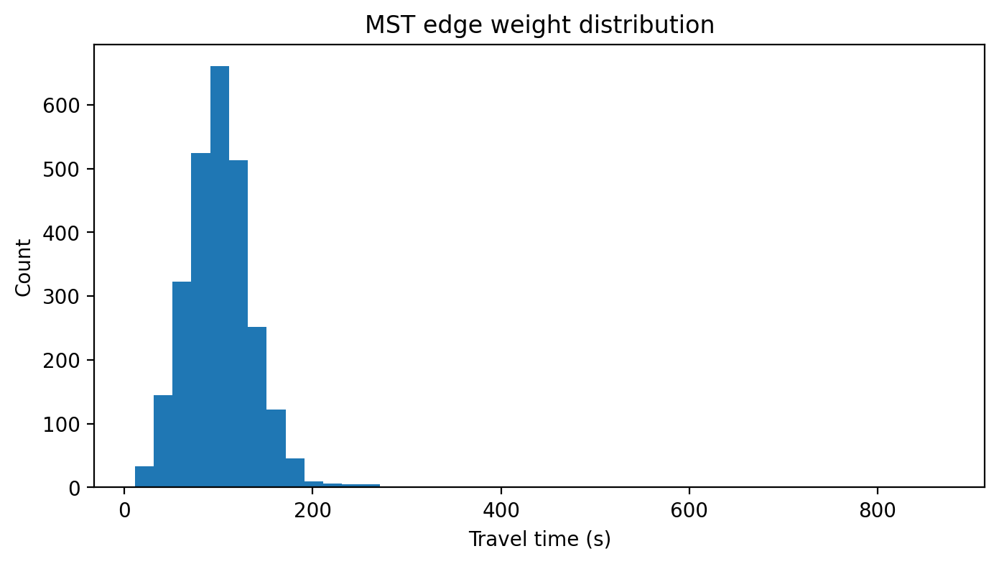
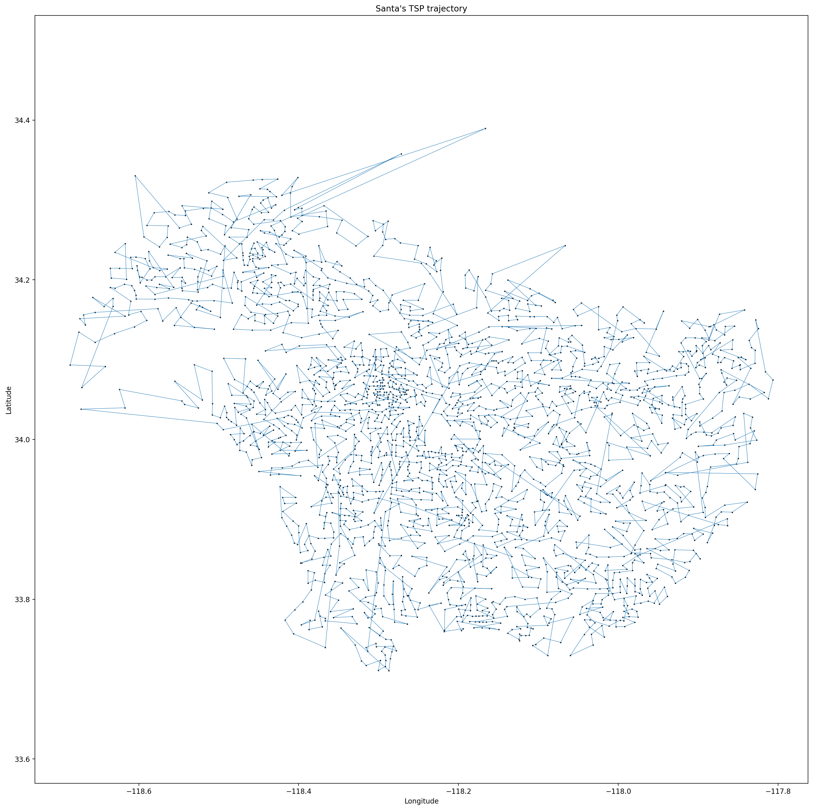
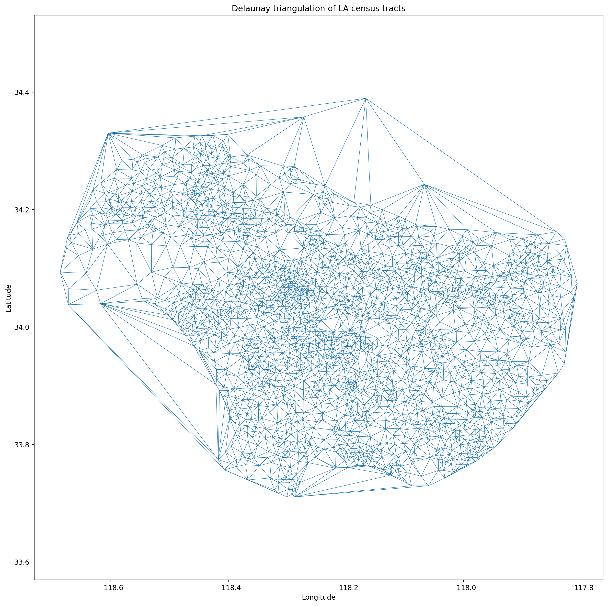
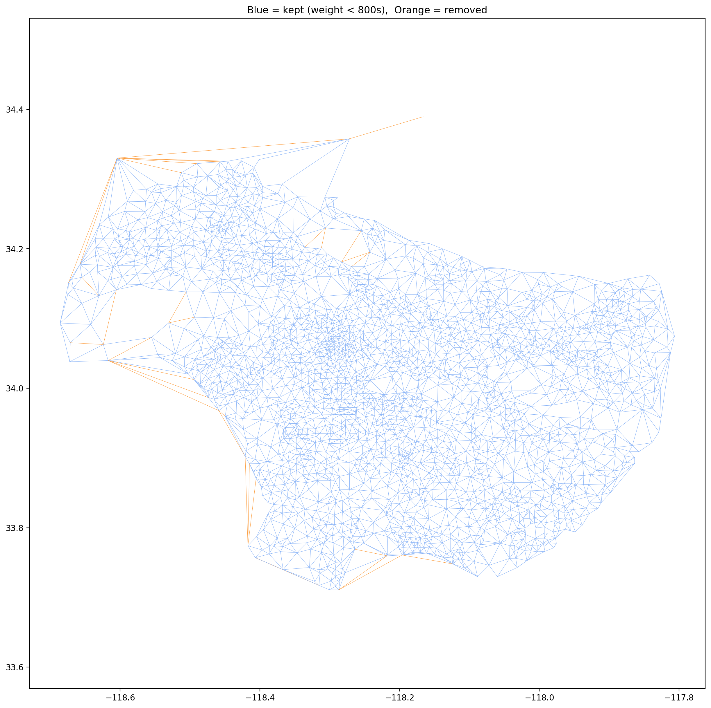
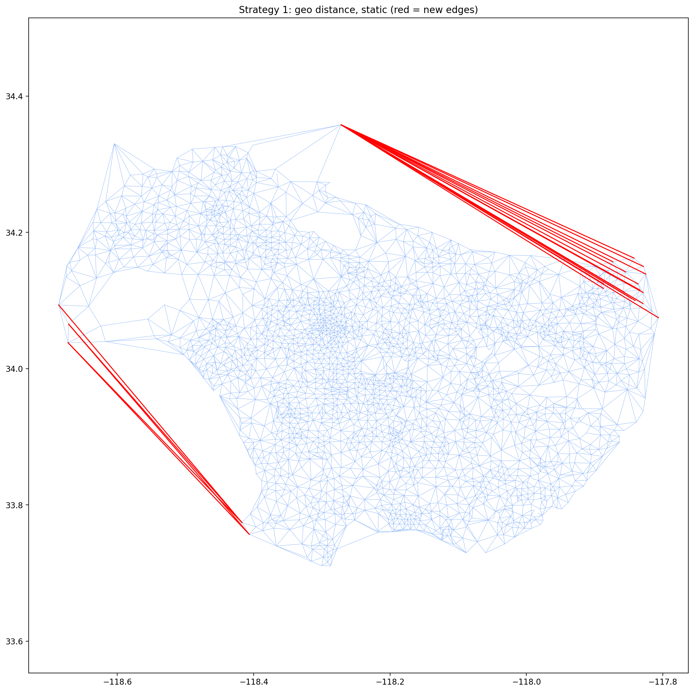
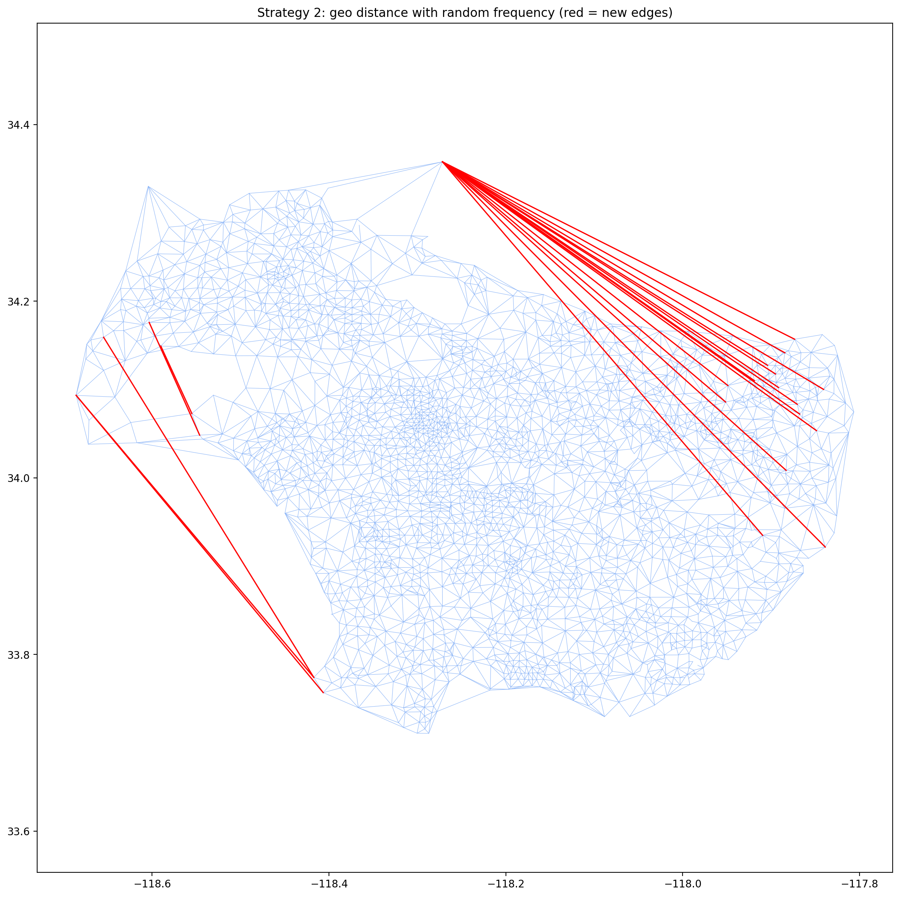
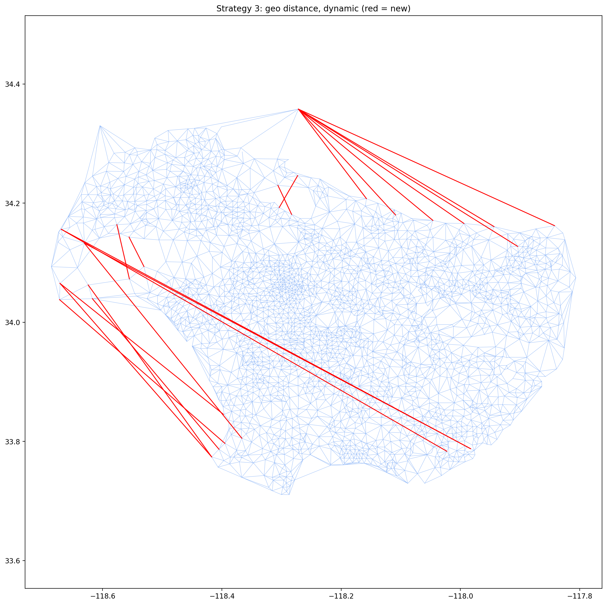
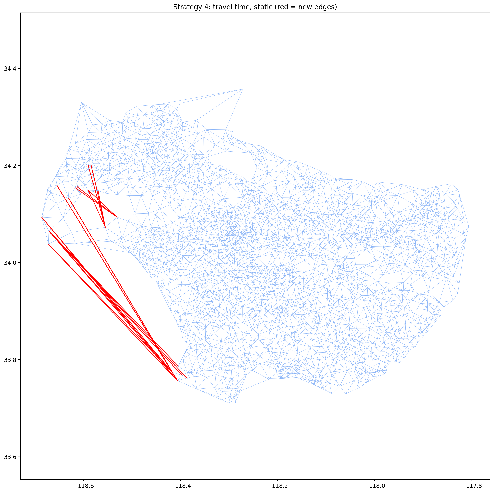
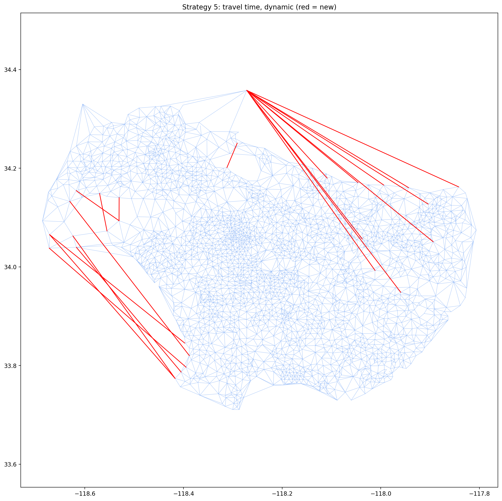
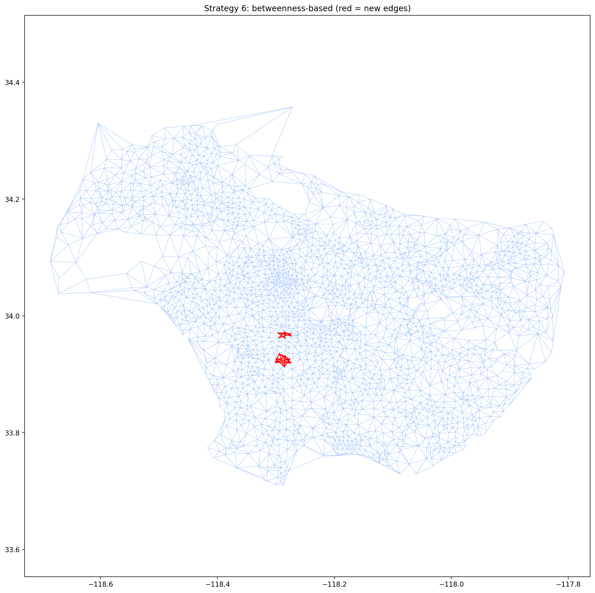

# ECE 232E Project 4 — Part 2 Report (Q9–Q24)

**Course:** ECE 232E — Large Scale Social and Complex Networks: Design and Algorithms  
**Term:** Spring 2026  
**Professor:** Prof. Vwani Roychowdhury  

---

## 2. Let's Help Santa!

All computations use **igraph** (Python). The graph is built from Uber Movement travel time data for Los Angeles (December 2019, monthly aggregate). Census tract centroids (longitude, latitude) are computed as the mean of polygon corner coordinates from the GeoJSON boundary file.

---

## Q9 — Build the Graph G

**Procedure:** Read the GeoJSON file to extract census tract centroids. Read the December travel-time CSV. Build an undirected weighted graph where nodes are census tracts and edge weights are mean travel times (seconds). Keep only the largest connected component and merge duplicate directed edges by averaging A→B and B→A.

### Answer

After removing isolated nodes / small components and merging duplicate edges, the cleaned graph **G** has:

| Property | Value |
|---|---|
| Nodes | **2,649** |
| Edges | **1,003,858** |

The original raw graph had 2,716 nodes and 1,692,450 edges. The reduction comes from (1) removing ~67 nodes not part of the main connected LA region, and (2) merging duplicate directed edges (A→B and B→A averaged into one undirected edge), which collapses ~1.69 M directed edges down to ~1.00 M undirected edges.

---

## Q10 — Minimum Spanning Tree + Edge Endpoints

**Procedure:** Build the MST of G using edge weights (travel times). Print coordinates of ~10 sample MST edges and identify approximate locations via Google Maps.

### Sample MST Edges

| Endpoint A (lat, lon) | Endpoint B (lat, lon) | Time (s) | Distance (mi) | Approx. Location |
|---|---|---|---|---|
| (34.10310, −118.12053) | (34.09626, −118.13138) | 129.8 | 0.885 | Alhambra / East LA |
| (34.10310, −118.12053) | (34.09585, −118.11656) | 118.3 | 0.570 | Alhambra |
| (34.09645, −118.13785) | (34.09626, −118.13138) | 90.2 | 0.447 | East LA |
| (34.09645, −118.13785) | (34.10349, −118.13225) | 126.5 | 0.621 | Boyle Heights area |
| (34.09645, −118.13785) | (34.08539, −118.14184) | 125.7 | 0.812 | City Terrace |
| (34.09626, −118.13138) | (34.08759, −118.12912) | 119.9 | 0.618 | East LA |
| (34.09868, −118.14492) | (34.09596, −118.15024) | 91.8 | 0.412 | East LA / City Terrace |
| (34.09863, −118.15281) | (34.09596, −118.15024) | 60.9 | 0.256 | City Terrace |
| (34.09863, −118.15281) | (34.09862, −118.15576) | 87.1 | 0.204 | East LA |
| (34.09863, −118.15281) | (34.10733, −118.15508) | 110.9 | 0.620 | El Sereno area |

*Figure: Distribution of MST edge weights (travel times, seconds).*

### Answer

**Are the results intuitive?** Yes. Every MST edge connects two geographically adjacent census tracts — straight-line distances are well under 1 mile and travel times fall in the ~60–130 s range shown above, consistent with neighbouring districts linked by local streets. The locations in the last column are approximate neighbourhood names obtained by pasting each centroid (lat, lon) into Google Maps; they are the nearest identifiable districts rather than exact street addresses. The MST captures backbone connectivity — it links neighbouring tracts instead of jumping across LA, exactly what an MST of a geographic travel-time graph should do. The "vine cluster" pattern reflects tracts in the same corridor (e.g. the San Gabriel Valley or the South Bay) being chained together by short, low-weight edges, mirroring the natural layout of LA's street grid.

---

## Q11 — Triangle Inequality

**Procedure:** Sample 1,000 random triangles (triples of vertices where all 3 edges exist in G). For each triangle, check whether the triangle inequality holds: the sum of any two sides ≥ the third side.

### Answer

**92.0%** of the 1,000 randomly sampled triangles satisfy the triangle inequality.

This is expected for a real-world road network: for most triples of locations, the direct route between any two is no longer than going through the third. The ~8% violations arise because:

1. **Traffic asymmetry / congestion effects** — the weight is mean travel time, not pure Euclidean distance; rush-hour conditions can make the "direct" edge slower than a two-hop detour.
2. **Discrete polygon centroids** — centroids of irregular census tract polygons introduce small geometric distortions, so the raw weight between two tracts may not perfectly reflect road-network distance.
3. **One-way streets and turn restrictions** — the original data is directional; after merging A→B and B→A into a single averaged edge, some information about asymmetric paths is lost.

The high satisfaction rate (92%) also confirms that the travel-time graph is a reasonable input for the TSP 1-approximation algorithm, whose performance guarantee relies on the triangle inequality holding.

---

## Q12 — TSP 1-Approximation

**Algorithm** (Papadimitriou & Steiglitz Ch. 17, p. 414):
1. Build MST T of G.
2. Perform DFS pre-order traversal starting from any node.
3. That traversal order defines the TSP tour (close it by returning to the start).

For each consecutive pair in the tour, compute the shortest-path cost in G (since a direct edge may not exist between shortcut nodes). Sum all costs to get the approximate TSP tour cost.

### Answer

| Quantity | Value |
|---|---|
| MST cost | 269,085 s |
| Approximate TSP cost | 422,811 s |
| Empirical ratio ρ̂ = TSP / MST | **1.57** |
| Theoretical upper bound | ≤ 2.0 |

**Why TSP/MST is an upper bound on ρ = TSP/Optimal:**

The MST provides a lower bound on the optimal TSP tour cost (removing any one edge from an optimal tour yields a spanning tree, whose cost is at least the MST cost):

$$\text{MST\_cost} \leq \text{Optimal\_TSP\_cost}$$

Therefore:

$$\rho = \frac{\text{TSP\_cost}}{\text{Optimal\_TSP\_cost}} \leq \frac{\text{TSP\_cost}}{\text{MST\_cost}} \approx 1.57$$

Our empirical upper bound of **ρ ≤ 1.57** is tighter than the classical worst-case guarantee of ρ ≤ 2, which is expected for a real-world, geographically structured graph (random worst-case graphs are atypical for road networks).

---

## Q13 — Santa's TSP Trajectory

**Procedure:** Plot the TSP tour computed in Q12 as a line over the LA map. Each consecutive pair of census tract centroids in the DFS pre-order is connected by a line.

The tour visits all 2,649 nodes exactly once. Because DFS pre-order does not optimize spatial locality, the trajectory appears highly tangled — it criss-crosses the entire LA basin repeatedly. This is characteristic of the 1-approximation algorithm: it is guaranteed to be within 2× optimal, but it does not try to minimize crossings.

*Figure: Santa's TSP trajectory (DFS pre-order of the MST) over all 2,649 census-tract centroids.*

---

## Q14 — Delaunay Triangulation

**Procedure:** Compute the Delaunay triangulation of all node centroids (longitude, latitude). Induce the subgraph of G on edges that appear in the triangulation simplices. This gives the Delaunay road mesh G_∆.

### Answer

**G_∆ has 2,648 nodes and 7,788 edges** (versus G's 1,003,858 edges). One node of G is dropped here: G_∆ keeps only Delaunay edges that *also* exist in G, and a single tract had no surviving incident edge, so it is not part of the induced subgraph.

*Figure: Delaunay road mesh G_∆ over the census-tract centroids.*

**Explanation of the Delaunay triangulation road mesh:**

The Delaunay triangulation connects each census-tract centroid to its "geometrically closest" neighbors, producing a planar graph with no long crossing edges. This is a natural approximation of a road network because:

1. **Nearby locations are connected** — among all triangulations of the point set, the Delaunay triangulation maximises the *minimum* angle (a global property), so it avoids thin slivers and tends to link each node to its true geographic neighbours rather than distant ones.
2. **Spatial coverage** — the triangulation covers the entire convex hull of LA's census tracts, capturing the grid-like street network in central LA and the sparser connections in the hills and coastal areas.
3. **Artifacts at boundaries** — along the coast and in mountainous areas (e.g. Topanga Canyon, the Santa Monica Mountains), the convex hull forces some long "bridging" edges across water or impassable terrain. These are the fake roads removed in Q17.

Overall, the mesh is a reasonable skeleton of the road network, with denser triangles in dense urban areas (downtown LA, the San Fernando Valley) and sparser, more elongated triangles at the periphery.

---

## Q15 — Traffic Flow Capacities

**Derivation of capacity (cars/hour) per road:**

Given assumptions:
- Car length = 5 m = **0.003 miles**
- Safety gap = **2-second headway** at current speed → gap distance = v × (2/3600) miles, where v is speed in mph
- Each road modeled with **2 lanes per direction**
- Speed: v (mph) = geographic distance d (miles) / travel time t (hours)

**Step-by-step:**

1. **Speed:** v = d / t, where d = |coord_A − coord_B| × 69 miles and t = weight / 3600 hours.
2. **Space per car** (bumper-to-bumper including 2 s safety gap):  
   s = 0.003 + v × (2/3600)  [miles/car]
3. **Cars per mile of road:**  
   cars_per_mile = 1 / s
4. **Flow per lane** (density × speed):  
   flow_per_lane = cars_per_mile × v  [cars/hr/lane]
5. **Total capacity** (2 lanes):  
   capacity = 2 × v / (0.003 + 2v/3600)  [cars/hr]

**Results:**

| Metric | Value |
|---|---|
| Mean capacity | **2,727 cars/hr** |
| Median speed | **17.3 mph** |

The mean capacity of ~2,727 cars/hr is the **two-lane** total; per lane this is ~1,363 cars/hr/lane, close to but slightly below typical urban-arterial figures (~1,500–2,000 cars/hr/lane), which is reasonable given the low median speed. The capacity formula saturates at 3600/2 = 1,800 cars/hr/lane as speed grows (the 2-second headway limit), so the model is internally consistent. The median speed of 17.3 mph reflects congested LA urban conditions.

---

## Q16 — Max Flow: Malibu → Long Beach

**Procedure:** Per the project specification, take Source = [34.04, −118.56] (Malibu) and Destination = [33.77, −118.18] (Long Beach). Find the G_∆ nodes closest to each, then compute (a) max flow using the Q15 edge capacities and (b) the edge-disjoint path count via edge connectivity.

### Answer

| Metric | Value |
|---|---|
| Source node | Census Tract 262604 (node 1511) — near Malibu |
| Destination node | Census Tract 576501 (node 660) — near Long Beach |
| Maximum cars/hour | **11,074** |
| Number of edge-disjoint paths | **4** |

**Does the number of edge-disjoint paths match the road map?**

Yes, this is intuitive. There are roughly **4 main independent corridors** connecting Malibu to Long Beach:

1. **Pacific Coast Highway (PCH / SR-1)** — coastal route hugging the shoreline
2. **I-405 / San Diego Freeway** — major inland north-south artery
3. **I-110 / Harbor Freeway** — runs north-south through South LA into Long Beach
4. **Surface street corridor** — through Culver City / Inglewood / Hawthorne

These correspond to the 4 edge-disjoint paths in the Delaunay graph. The result makes geographic sense: to travel from Malibu to Long Beach you must cross the LA basin, and there are only a small number of truly independent routes.

---

## Q17 — Trim Large-Distance (Fake) Edges

**Procedure:** Remove edges from G_∆ with travel time > 800 seconds (~13 min). Keep the largest connected component of the resulting graph, yielding G̃_∆.

### Answer

**G̃_∆ has 2,647 nodes and 7,756 edges** (32 fake edges removed from G_∆'s 7,788).

*Figure: G_∆ with edges over the 800 s threshold highlighted (orange = removed, blue = kept). Removed edges span open water and impassable terrain.*

**Did the thresholding method work?**

Largely **yes**. The removed edges cross open water (Santa Monica Bay, San Pedro Bay) or cut through impassable terrain (Santa Monica Mountains, Topanga Canyon ridgelines). These are clearly artifacts of the Delaunay convex-hull extension. Removing edges with travel time > 800 s captures most artifacts because:

- A real short-distance road would have a travel time well under 800 s even at slow urban speeds.
- Fake "water crossing" edges span large straight-line distances — their travel-time estimates end up implausibly high.

**Limitations:** The threshold is a blunt instrument. A few real but slow roads (congested or winding mountain roads) could also be removed, and some short fake edges below the threshold might survive. A more principled approach would use geographic features (coastline, elevation data) to filter impossible edges, but the simple time threshold captures the majority of artifacts.

---

## Q18 — Max Flow on Trimmed Graph

**Procedure:** Repeat Q16 on G̃_∆ (trimmed graph).

### Answer

| Metric | G_∆ (Q16) | G̃_∆ (Q18) |
|---|---|---|
| Edge-disjoint paths | 4 | **4** |
| Max cars/hour | 11,074 | **11,074** |

**Do you see any changes? Why?**

The results are **identical** to Q16. This is expected because:

1. **The 32 removed edges were not part of any Malibu–Long Beach path.** The fake edges crossed water or impassable terrain and were never on any valid route between the two coastal nodes.
2. **The Malibu and Long Beach nodes are well-connected inland nodes.** Their routes traverse real urban roads (PCH, I-405, I-110, surface streets), all of which have travel times well under 800 s per census-tract segment.
3. **Max-flow is determined by the minimum cut.** The minimum cut uses the 4 real corridor edges, all of which survived the trimming.

If the threshold had been set more aggressively (e.g. 300 s), real roads would be removed and the results would change.

---

## Q19–Q23 — Road Network Improvement Strategies

**Setup:** Starting from G̃_∆, add exactly 20 new edges to improve average path length. Five strategies are evaluated.

---

### Q19 — Strategy 1: Geo Distance, Static

**Method:** Compute the all-pairs shortest-path distance matrix (using geographic distance as edge weight) and the all-pairs Euclidean distance matrix. For each pair (v, s), compute the extra distance:

$$\text{extra\_distance}(v, s) = \text{shortest\_path\_distance}(v, s) - \text{euclidean}(v, s)$$

Select the 20 pairs with the highest extra distance and add them as new edges.

**All 20 added edges:**

| # | Pair | Extra distance (mi) |
|---|---|---|
| 1 | [1783, 2416] | 8.047 |
| 2 | [2140, 2419] | 8.016 |
| 3 | [1860, 2416] | 7.876 |
| 4 | [382, 2419] | 7.823 |
| 5 | [383, 2419] | 7.617 |
| 6 | [1699, 1783] | 7.513 |
| 7 | [391, 2419] | 7.502 |
| 8 | [1901, 2419] | 7.460 |
| 9 | [381, 2419] | 7.449 |
| 10 | [1699, 1860] | 7.355 |
| 11 | [2163, 2419] | 7.354 |
| 12 | [386, 2419] | 7.318 |
| 13 | [390, 2419] | 7.315 |
| 14 | [1904, 2419] | 7.280 |
| 15 | [45, 2419] | 7.269 |
| 16 | [1783, 2413] | 7.268 |
| 17 | [1906, 2419] | 7.268 |
| 18 | [2158, 2419] | 7.268 |
| 19 | [1902, 2419] | 7.265 |
| 20 | [392, 2419] | 7.254 |

**Time complexity:** O(V · (V + E) · log V) for all-pairs Dijkstra + O(V² log V) for sorting.

---

### Q20 — Strategy 2: Geo Distance with Random Demand Frequency, Static

**Method:** Same as Strategy 1, but multiply each pair's extra distance by a random demand frequency sampled uniformly from [1, 1000]:

$$\text{score}(v, s) = \text{extra\_distance}(v, s) \times \text{frequency}(v, s)$$

Select the 20 pairs with the highest weighted score.

**All 20 added edges:**

| # | Pair | Weighted extra (mi × demand) |
|---|---|---|
| 1 | [2141, 2419] | 6,709 |
| 2 | [2164, 2419] | 6,492 |
| 3 | [989, 1510] | 6,293 |
| 4 | [1783, 2413] | 6,084 |
| 5 | [1906, 2419] | 6,040 |
| 6 | [383, 2419] | 5,941 |
| 7 | [2057, 2419] | 5,890 |
| 8 | [2156, 2419] | 5,858 |
| 9 | [2052, 2419] | 5,843 |
| 10 | [2419, 2472] | 5,808 |
| 11 | [49, 2419] | 5,771 |
| 12 | [2419, 2463] | 5,708 |
| 13 | [2193, 2419] | 5,705 |
| 14 | [2161, 2419] | 5,695 |
| 15 | [69, 2419] | 5,666 |
| 16 | [1860, 2413] | 5,519 |
| 17 | [979, 1511] | 5,508 |
| 18 | [430, 1783] | 5,508 |
| 19 | [231, 2419] | 5,495 |
| 20 | [66, 2419] | 5,482 |

**Time complexity:** O(V · (V + E) · log V) — same as Strategy 1; the frequency multiplication adds O(V²).

---

### Q21 — Strategy 3: Geo Distance, Dynamic

**Method:** Greedy dynamic version of Strategy 1. After each added edge, recompute the full all-pairs shortest-path matrix and select the next best edge. Repeat for 20 iterations.

**All 20 edges added (one per iteration):**

| Step | Pair | Extra distance (mi) |
|---|---|---|
| 1 | [1783, 2416] | 8.047 |
| 2 | [2140, 2419] | 8.016 |
| 3 | [986, 1510] | 7.220 |
| 4 | [49, 2419] | 7.142 |
| 5 | [285, 2419] | 7.001 |
| 6 | [1717, 2419] | 6.626 |
| 7 | [1783, 2417] | 6.193 |
| 8 | [1956, 2419] | 6.078 |
| 9 | [2247, 2419] | 5.571 |
| 10 | [1005, 1678] | 5.434 |
| 11 | [2414, 2619] | 5.349 |
| 12 | [121, 689] | 5.106 |
| 13 | [2242, 2419] | 5.079 |
| 14 | [1699, 1781] | 5.066 |
| 15 | [144, 2619] | 5.004 |
| 16 | [2402, 2416] | 4.857 |
| 17 | [144, 2040] | 4.719 |
| 18 | [1700, 1782] | 4.605 |
| 19 | [356, 1679] | 4.563 |
| 20 | [2414, 2559] | 4.477 |

**Time complexity:** O(k · V · (V + E) · log V) for k = 20 iterations.

---

### Q22 — Strategy 4: Travel Time, Static

**Method:** Use travel time rather than geographic distance as the detour metric. For each pair:

$$\text{extra\_time}(v, s) = \text{shortest\_time}(v, s) - \frac{\text{euclidean}(v, s)}{\text{effective\_speed}(v, s)}$$

where effective_speed = shortest_path_distance / shortest_time. Note this is a *path-level* effective speed (distance and time both taken along shortest paths, so freeway segments pull it up), giving a median of ~24.2 mph = 0.0067 mi/s. This is deliberately different from Q15's 17.3 mph, which is a *per-edge* median speed; the two measure different things and are not in conflict.

**All 20 added edges:**

| # | Pair | Extra time (s) |
|---|---|---|
| 1 | [1783, 2416] | 1,270.4 |
| 2 | [1860, 2416] | 1,252.9 |
| 3 | [1783, 2413] | 1,153.9 |
| 4 | [1859, 2416] | 1,146.3 |
| 5 | [1860, 2413] | 1,134.2 |
| 6 | [1699, 1783] | 1,132.4 |
| 7 | [1699, 1860] | 1,119.7 |
| 8 | [985, 1678] | 1,107.7 |
| 9 | [988, 1510] | 1,104.6 |
| 10 | [1782, 2416] | 1,094.0 |
| 11 | [989, 1510] | 1,075.8 |
| 12 | [144, 1783] | 1,071.6 |
| 13 | [144, 1860] | 1,053.8 |
| 14 | [430, 1783] | 1,051.7 |
| 15 | [950, 1510] | 1,044.5 |
| 16 | [989, 1678] | 1,043.7 |
| 17 | [1882, 2416] | 1,041.6 |
| 18 | [430, 1860] | 1,034.1 |
| 19 | [951, 1510] | 1,032.7 |
| 20 | [984, 1678] | 1,030.2 |

**Time complexity:** O(V · (V + E) · log V) — two all-pairs Dijkstra calls (time-weighted and distance-weighted).

---

### Q23 — Strategy 5: Travel Time, Dynamic

**Method:** Greedy dynamic version of Strategy 4. Recompute extra_time after each added edge. Repeat for 20 iterations.

**All 20 edges added (one per iteration):**

| Step | Pair | Extra time (s) |
|---|---|---|
| 1 | [1783, 2416] | 1,270.4 |
| 2 | [985, 1678] | 1,107.7 |
| 3 | [988, 1510] | 1,104.6 |
| 4 | [2140, 2419] | 978.1 |
| 5 | [1783, 2417] | 968.1 |
| 6 | [2081, 2419] | 906.9 |
| 7 | [49, 2419] | 897.5 |
| 8 | [285, 2419] | 854.6 |
| 9 | [2262, 2419] | 834.3 |
| 10 | [2273, 2419] | 793.4 |
| 11 | [1717, 2419] | 790.4 |
| 12 | [2402, 2416] | 772.4 |
| 13 | [1003, 1678] | 739.9 |
| 14 | [1965, 2419] | 735.9 |
| 15 | [1956, 2419] | 724.9 |
| 16 | [120, 687] | 699.1 |
| 17 | [1699, 1781] | 683.2 |
| 18 | [2247, 2419] | 678.6 |
| 19 | [1700, 1782] | 676.1 |
| 20 | [144, 1875] | 656.8 |

**Time complexity:** O(k · V · (V + E) · log V) — same as Strategy 3 but with two shortest-path calls per iteration.

---

## Q24 — Strategy Comparison and Analysis

### Numeric Summary

Each strategy is reported under **both** objectives. The fair comparison is to judge a strategy on the objective it optimises: geometric strategies (S1, S2, S3, S6) on **Avg dist**, travel-time strategies (S4, S5) on **Avg time**.

| Strategy | Avg dist (mi) | Avg time (s) |
|---|---|---|
| Baseline (no new roads) | 20.837 | 3036.1 |
| S1: geo distance, static | 20.836 | 3036.0 |
| S2: geo distance + frequency | 20.832 | 3035.9 |
| S3: geo distance, dynamic | 20.823 | 3035.8 |
| S4: travel time, static | 20.825 | 3035.8 |
| S5: travel time, dynamic | 20.825 | 3035.7 |
| S6: betweenness | 20.833 | 3030.5 |

*Note:* The maximum-path pair stays unchanged because it is a genuinely distant pair that no strategy targets (no detour to remove). Improvements are small in absolute terms because 20 edges on ~7,756 is a minor intervention, and the selected detour endpoints are peripheral hull-tip nodes that lie on few shortest paths. **Each strategy must be judged under the objective it optimises** (distance vs time), not under a single shared metric — otherwise a time-optimising strategy looks worse simply because it was scored on distance.

---

### (a) Strategy 1 vs Strategy 2

S2 multiplies each pair's detour by a random demand frequency in [1, 1000]. This shifts focus from *geometrically* worst detours to *high-demand pairs with moderate detours*. With truly random demand, S2 can select pairs where the demand is high but the detour is only moderate — potentially adding less useful shortcuts than S1. On the Avg dist metric, S2 (20.832) edges slightly below S1 (20.836) here, but this is essentially within noise.

**Which is better?** If the demand signal were real (based on actual travel patterns), S2 would be the stronger choice because it optimises user welfare rather than pure geometry. With random demand, S2 is not reliably better than S1. In practice, **S2 with real demand data** would be preferred.

---

### (b) Strategy 1 vs Strategy 3

Both optimise the **geographic-distance** detour. S1 picks all 20 edges in one shot from the *initial* shortest-path matrix, so it can target several pairs that all benefit from the same single shortcut (redundancy). S3 re-evaluates after each addition, so each new edge is the best given the roads already added. Under the matching **Avg dist** metric, S3 (20.823) < S1 (20.836).

**Which is better?** Under the geographic objective, **S3 ≥ S1** (never worse, here slightly better), at the cost of ~20× more all-pairs shortest-path computations.

---

### (c) Strategy 1 vs Strategy 4

S1 optimises geometric (Euclidean) detour; S4 optimises travel-time detour. They are **not directly comparable on one metric** — each is best on its own objective. On Avg dist, S1 targets the geometrically worst pairs; on Avg time, S4 targets the pairs whose commute is most unreasonable relative to straight-line time. Judged each under its own objective, both reduce their target quantity below baseline.

**Which is better?** For commuter welfare, **S4's travel-time objective is more relevant** — reducing time matters more than reducing geographic distance in urban planning — but this is a choice of objective, not one strategy dominating the other on a shared metric.

---

### (d) Static vs Dynamic — Is Either Optimal?

**Neither is globally optimal.** Jointly choosing all 20 edges to minimise the objective is a combinatorial network-design problem, NP-hard in general.

Comparing fairly — **each dynamic strategy against the static strategy that shares its objective**:
- Geometric objective: S3 (dynamic, 20.823) ≤ S1 (static, 20.836) on Avg dist.
- Travel-time objective: S5 (dynamic, 3035.7) ≤ S4 (static, 3035.8) on Avg time.

So dynamic greedy is **no worse than, and usually better than, static at the same budget when judged on the matching objective**, because it avoids re-targeting the same bottleneck. (An apparent reversal only appears if a time-optimising strategy is scored on the distance metric; under the correct objective the expected ordering holds.) Dynamic greedy is still only a **1-step-lookahead** heuristic and cannot anticipate interactions between future edges.

**A better approach:** beam search — keep the top-B candidates at each step and evaluate the objective for each, exploring more of the solution space, at O(B · k · V · (V + E) · log V). A globally optimal selection would solve an Integer Linear Program (ILP) over all size-20 edge sets, intractable for V ≈ 2,647.

---

### (e) Strategy 6 — Betweenness-Based Bottleneck Relief (Open-Ended)

**Motivation:** Strategies 1–5 all optimise *detour* for individual pairs. Network robustness is better characterized by **edge betweenness centrality** — edges that lie on many shortest paths are bottlenecks whose failure or congestion disrupts the entire network. Adding parallel routes around the highest-betweenness edges reduces both congestion and vulnerability.

**Strategy:** Score each non-adjacent pair (u, v) by the maximum edge betweenness on a path that bypasses a loaded edge between them. Add the 20 pairs with the highest scores as new edges.

**Top 5 highest-betweenness existing edges:**

| Edge | Betweenness |
|---|---|
| 1490 ↔ 1613 | 490,446 |
| 1451 ↔ 1457 | 482,062 |
| 1410 ↔ 1414 | 481,366 |
| 1414 ↔ 1420 | 480,964 |
| 1457 ↔ 1458 | 480,196 |

**Results:** Under the geographic objective, Strategy 6 achieves an Avg dist of ~20.833 mi, comparable to S2; notably, it gives the **largest reduction in Avg time** of any strategy (3030.5 s vs baseline 3036.1 s). Because it targets structural bottlenecks rather than individual peripheral detours, its benefit is spread across many central shortest paths rather than concentrated at the hull tips — which is exactly why it helps travel time the most.

**Justification:**
- High-betweenness edges carry disproportionate traffic; congestion there hurts everyone.
- Adding detour-bypassing edges around these bottlenecks reduces average path length *and* improves fault tolerance.
- Unlike Strategy 2's random frequencies, betweenness provides a *principled*, structure-derived demand estimate.

**Time complexity:** O(V · E + V² · log V) — dominated by the weighted Brandes betweenness algorithm (equivalent to one all-pairs Dijkstra).

---

*End of Q9–Q24 Report*